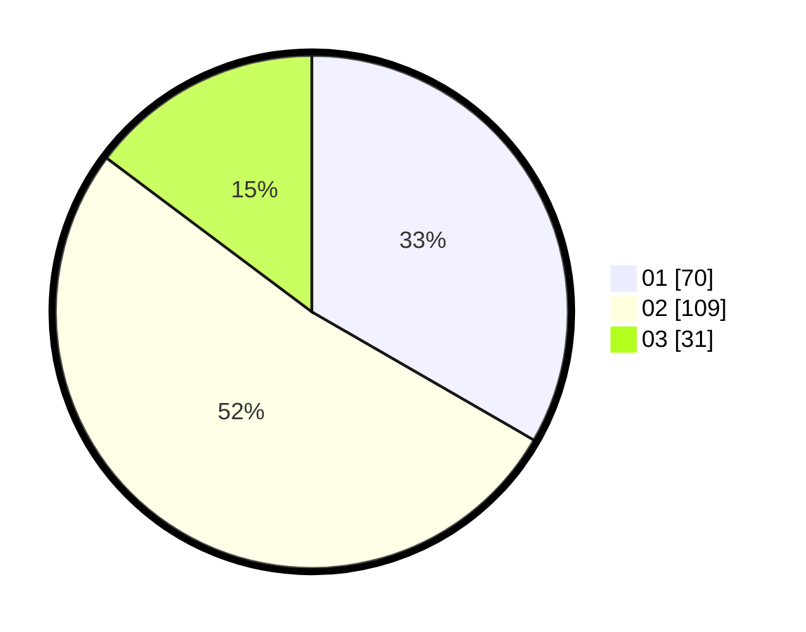

# Hasil

Hasil perolehan suara paslon dapat dilihat pada file paslon-01.txt, paslon-02.txt, dan paslon-03.txt.

Jika tidak ada, artinya data tersebut belum ada pada SIREKAP.

## Perolehan Suara

 * Paslon 01: **70**.
 * Paslon 02: **109**.
 * Paslon 03: **31**.

## Foto C Plano

https://sirekap-obj-formc.kpu.go.id/a4c4/pemilu/ppwp/31/72/02/10/06/3172021006008-20240215-002555--1c9076b1-8436-4ac9-805e-2e7f31e083ac.jpg

https://sirekap-obj-formc.kpu.go.id/a4c4/pemilu/ppwp/31/72/02/10/06/3172021006008-20240215-002809--3fe1eb5f-da15-4737-a51d-819944e57abd.jpg

https://sirekap-obj-formc.kpu.go.id/a4c4/pemilu/ppwp/31/72/02/10/06/3172021006008-20240215-002934--f7d9e3f4-3274-4e59-af70-2a7b77ee50dc.jpg

## DATA PEMILIH TETAP

Jumlah pemilih dalam DPT: **296**.
 * L: **144**.
 * P: **152**.

## DATA PENGGUNA HAK PILIH

Jumlah pengguna hak pilih dalam DPT: **212**.
 * L: **96**.
 * P: **116**.

Jumlah pengguna hak pilih dalam DPTb: **0**.
 * L: **0**.
 * P: **0**.

Jumlah pengguna hak pilih dalam DPK: **0**.
 * L: **0**.
 * P: **0**.

Jumlah pengguna hak pilih: **212**.
 * L: **96**.
 * P: **116**.

## JUMLAH SUARA SAH DAN TIDAK SAH

JUMLAH SELURUH SUARA SAH: **210**.

JUMLAH SUARA TIDAK SAH: **2**.

JUMLAH SELURUH SUARA SAH DAN SUARA TIDAK SAH: **212**.
