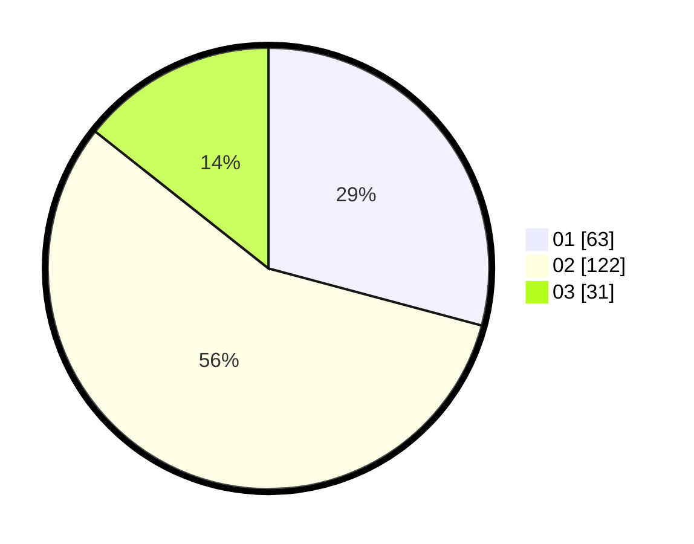

# Hasil

Hasil perolehan suara paslon dapat dilihat pada file paslon-01.txt, paslon-02.txt, dan paslon-03.txt.

Jika tidak ada, artinya data tersebut belum ada pada SIREKAP.

## Perolehan Suara

 * Paslon 01: **63**.
 * Paslon 02: **122**.
 * Paslon 03: **31**.

## Foto C Plano

https://sirekap-obj-formc.kpu.go.id/3775/pemilu/ppwp/31/72/02/10/06/3172021006010-20240217-141217--7519c499-e9f9-4aac-9b13-00bd5e5f0b8d.jpg

https://sirekap-obj-formc.kpu.go.id/3775/pemilu/ppwp/31/72/02/10/06/3172021006010-20240217-141249--29818b4f-19ee-4a43-8733-0a74cb51f7b0.jpg

https://sirekap-obj-formc.kpu.go.id/3775/pemilu/ppwp/31/72/02/10/06/3172021006010-20240217-141334--2fc199e2-7a21-4504-a028-e3beca2c120a.jpg

## DATA PEMILIH TETAP

Jumlah pemilih dalam DPT: **296**.
 * L: **144**.
 * P: **152**.

## DATA PENGGUNA HAK PILIH

Jumlah pengguna hak pilih dalam DPT: **222**.
 * L: **113**.
 * P: **109**.

Jumlah pengguna hak pilih dalam DPTb: **1**.
 * L: **0**.
 * P: **1**.

Jumlah pengguna hak pilih dalam DPK: **1**.
 * L: **0**.
 * P: **1**.

Jumlah pengguna hak pilih: **224**.
 * L: **113**.
 * P: **111**.

## JUMLAH SUARA SAH DAN TIDAK SAH

JUMLAH SELURUH SUARA SAH: **216**.

JUMLAH SUARA TIDAK SAH: **8**.

JUMLAH SELURUH SUARA SAH DAN SUARA TIDAK SAH: **224**.
