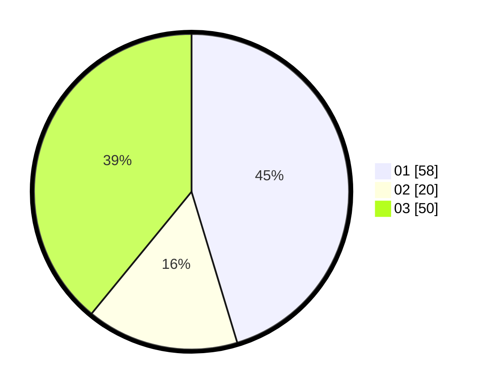

# Hasil

Hasil perolehan suara paslon dapat dilihat pada file paslon-01.txt, paslon-02.txt, dan paslon-03.txt.

Jika tidak ada, artinya data tersebut belum ada pada SIREKAP.

## Perolehan Suara

 * Paslon 01: **58**.
 * Paslon 02: **20**.
 * Paslon 03: **50**.

## Foto C Plano

https://sirekap-obj-formc.kpu.go.id/37ca/pemilu/ppwp/31/72/02/10/06/3172021006014-20240214-202817--1cd25023-7b5d-4b82-9e20-2ce969775e91.jpg

https://sirekap-obj-formc.kpu.go.id/37ca/pemilu/ppwp/31/72/02/10/06/3172021006014-20240214-202502--e9f4dd84-f872-4bb3-a380-4fe1d87c5b91.jpg

https://sirekap-obj-formc.kpu.go.id/37ca/pemilu/ppwp/31/72/02/10/06/3172021006014-20240214-202625--7101d58f-2cfc-4b4c-98ca-6f85baaedcbc.jpg

## DATA PEMILIH TETAP

Jumlah pemilih dalam DPT: **297**.
 * L: **148**.
 * P: **149**.

## DATA PENGGUNA HAK PILIH

Jumlah pengguna hak pilih dalam DPT: **225**.
 * L: **104**.
 * P: **786**.

Jumlah pengguna hak pilih dalam DPTb: **2**.
 * L: **2**.
 * P: **1**.

Jumlah pengguna hak pilih dalam DPK: **4**.
 * L: **0**.
 * P: **4**.

Jumlah pengguna hak pilih: **232**.
 * L: **118**.
 * P: **124**.

## JUMLAH SUARA SAH DAN TIDAK SAH

JUMLAH SELURUH SUARA SAH: **228**.

JUMLAH SUARA TIDAK SAH: **4**.

JUMLAH SELURUH SUARA SAH DAN SUARA TIDAK SAH: **232**.
