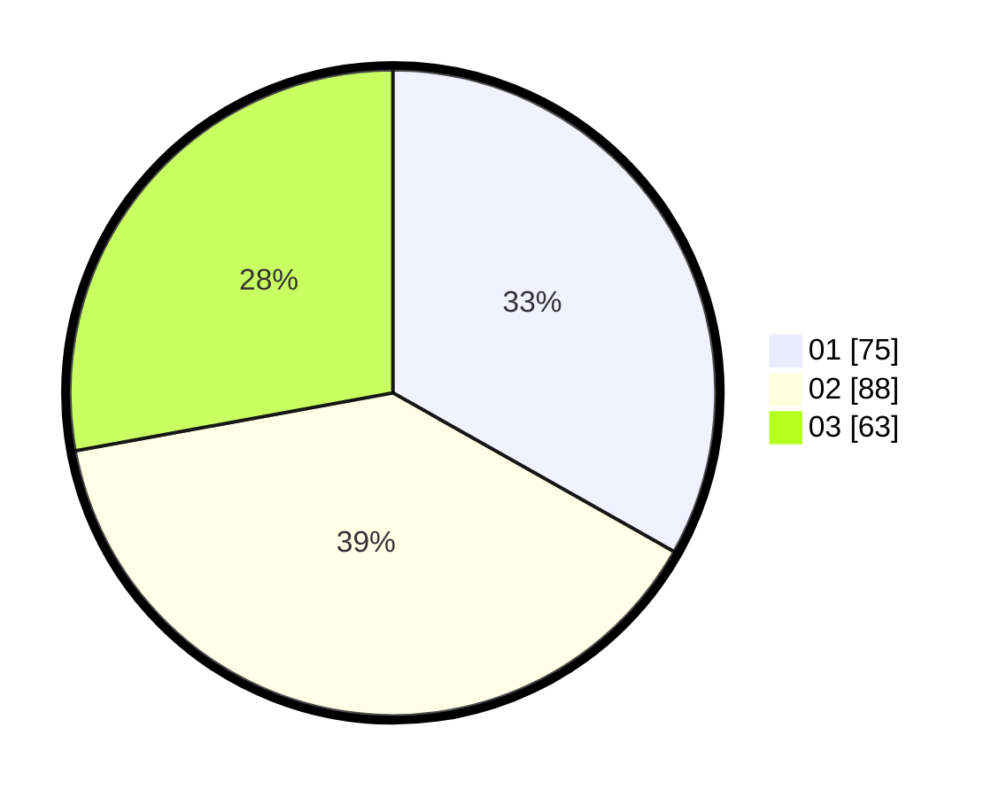

# Hasil

Hasil perolehan suara paslon dapat dilihat pada file paslon-01.txt, paslon-02.txt, dan paslon-03.txt.

Jika tidak ada, artinya data tersebut belum ada pada SIREKAP.

## Perolehan Suara

 * Paslon 01: **75**.
 * Paslon 02: **88**.
 * Paslon 03: **63**.

## Foto C Plano

https://sirekap-obj-formc.kpu.go.id/c52b/pemilu/ppwp/31/72/02/10/06/3172021006016-20240216-133634--1ecfe6cd-48b7-4c08-92a6-0731317e80ee.jpg

https://sirekap-obj-formc.kpu.go.id/c52b/pemilu/ppwp/31/72/02/10/06/3172021006016-20240216-133636--a37e5244-e8ed-4a1f-8f59-ce48f3f91d06.jpg

https://sirekap-obj-formc.kpu.go.id/c52b/pemilu/ppwp/31/72/02/10/06/3172021006016-20240216-133635--cb6f0503-dbe7-4334-8e11-474f771f6523.jpg

## DATA PEMILIH TETAP

Jumlah pemilih dalam DPT: **292**.
 * L: **148**.
 * P: **144**.

## DATA PENGGUNA HAK PILIH

Jumlah pengguna hak pilih dalam DPT: **230**.
 * L: **116**.
 * P: **114**.

Jumlah pengguna hak pilih dalam DPTb: **0**.
 * L: **0**.
 * P: **0**.

Jumlah pengguna hak pilih dalam DPK: **0**.
 * L: **0**.
 * P: **1**.

Jumlah pengguna hak pilih: **231**.
 * L: **116**.
 * P: **115**.

## JUMLAH SUARA SAH DAN TIDAK SAH

JUMLAH SELURUH SUARA SAH: **226**.

JUMLAH SUARA TIDAK SAH: **5**.

JUMLAH SELURUH SUARA SAH DAN SUARA TIDAK SAH: **231**.
