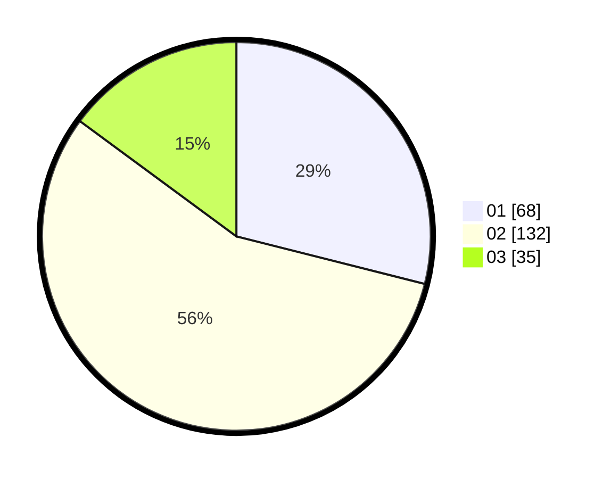

# Hasil

Hasil perolehan suara paslon dapat dilihat pada file paslon-01.txt, paslon-02.txt, dan paslon-03.txt.

Jika tidak ada, artinya data tersebut belum ada pada SIREKAP.

## Perolehan Suara

 * Paslon 01: **68**.
 * Paslon 02: **132**.
 * Paslon 03: **35**.

## Foto C Plano

https://sirekap-obj-formc.kpu.go.id/8682/pemilu/ppwp/31/72/02/10/06/3172021006024-20240217-145545--f66261e0-da27-470d-9b02-405fad73ba75.jpg

https://sirekap-obj-formc.kpu.go.id/8682/pemilu/ppwp/31/72/02/10/06/3172021006024-20240217-150103--b300cad6-3d20-490f-8bac-707e4a9731b3.jpg

https://sirekap-obj-formc.kpu.go.id/8682/pemilu/ppwp/31/72/02/10/06/3172021006024-20240217-145847--f77bc5c1-d42b-4303-a245-cf3f0177cf54.jpg

## DATA PEMILIH TETAP

Jumlah pemilih dalam DPT: **295**.
 * L: **138**.
 * P: **157**.

## DATA PENGGUNA HAK PILIH

Jumlah pengguna hak pilih dalam DPT: **229**.
 * L: **107**.
 * P: **122**.

Jumlah pengguna hak pilih dalam DPTb: **1**.
 * L: **0**.
 * P: **1**.

Jumlah pengguna hak pilih dalam DPK: **7**.
 * L: **5**.
 * P: **2**.

Jumlah pengguna hak pilih: **237**.
 * L: **112**.
 * P: **125**.

## JUMLAH SUARA SAH DAN TIDAK SAH

JUMLAH SELURUH SUARA SAH: **235**.

JUMLAH SUARA TIDAK SAH: **2**.

JUMLAH SELURUH SUARA SAH DAN SUARA TIDAK SAH: **237**.
