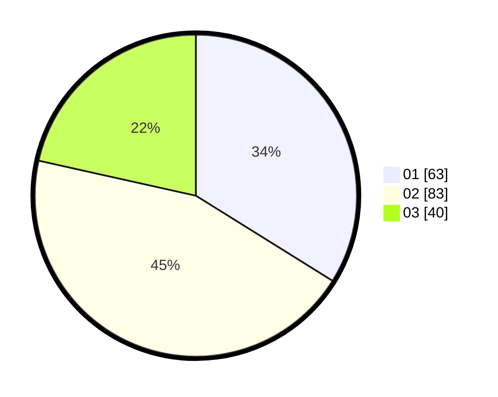

# Hasil

Hasil perolehan suara paslon dapat dilihat pada file paslon-01.txt, paslon-02.txt, dan paslon-03.txt.

Jika tidak ada, artinya data tersebut belum ada pada SIREKAP.

## Perolehan Suara

 * Paslon 01: **63**.
 * Paslon 02: **83**.
 * Paslon 03: **40**.

## Foto C Plano

https://sirekap-obj-formc.kpu.go.id/d702/pemilu/ppwp/31/72/02/10/06/3172021006032-20240214-222646--3b24ee14-3d7b-4728-9a29-1308be8d37d8.jpg

https://sirekap-obj-formc.kpu.go.id/d702/pemilu/ppwp/31/72/02/10/06/3172021006032-20240214-222837--a77a0f75-4a38-461c-8f58-f2e633b6fe7a.jpg

https://sirekap-obj-formc.kpu.go.id/d702/pemilu/ppwp/31/72/02/10/06/3172021006032-20240214-223120--a9abb0ef-9088-4234-9076-fa6af98869ac.jpg

## DATA PEMILIH TETAP

Jumlah pemilih dalam DPT: **296**.
 * L: **152**.
 * P: **144**.

## DATA PENGGUNA HAK PILIH

Jumlah pengguna hak pilih dalam DPT: **182**.
 * L: **87**.
 * P: **95**.

Jumlah pengguna hak pilih dalam DPTb: **1**.
 * L: **0**.
 * P: **1**.

Jumlah pengguna hak pilih dalam DPK: **3**.
 * L: **1**.
 * P: **2**.

Jumlah pengguna hak pilih: **186**.
 * L: **88**.
 * P: **98**.

## JUMLAH SUARA SAH DAN TIDAK SAH

JUMLAH SELURUH SUARA SAH: **186**.

JUMLAH SUARA TIDAK SAH: **0**.

JUMLAH SELURUH SUARA SAH DAN SUARA TIDAK SAH: **186**.
