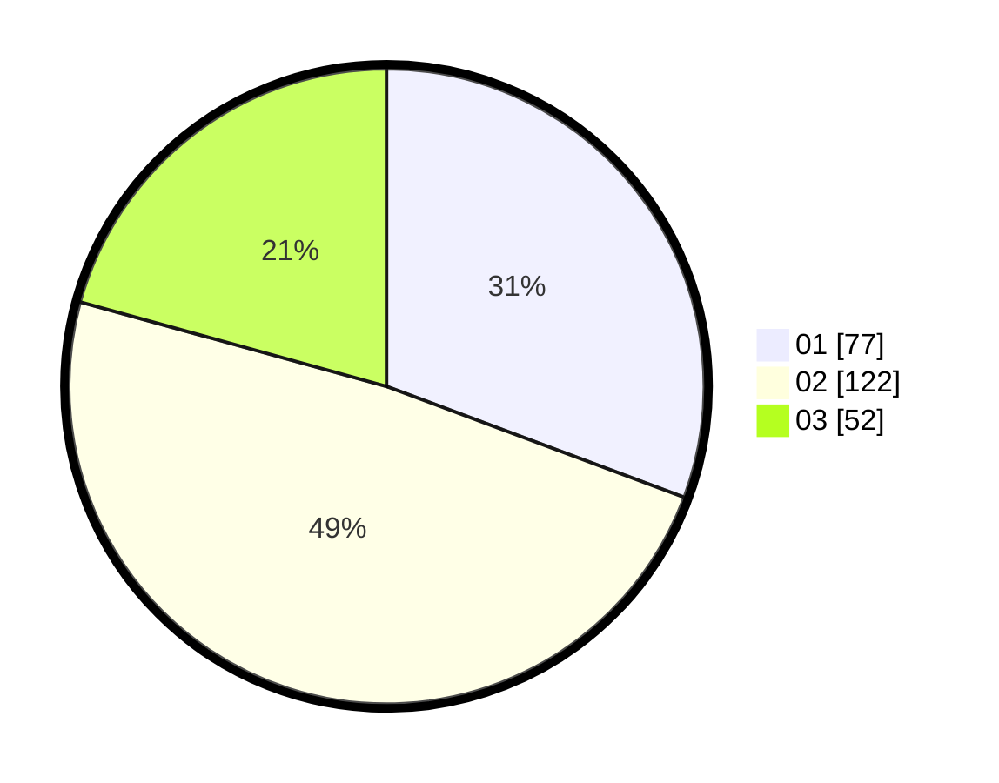

# Hasil

Hasil perolehan suara paslon dapat dilihat pada file paslon-01.txt, paslon-02.txt, dan paslon-03.txt.

Jika tidak ada, artinya data tersebut belum ada pada SIREKAP.

## Perolehan Suara

 * Paslon 01: **77**.
 * Paslon 02: **122**.
 * Paslon 03: **52**.

## Foto C Plano

https://sirekap-obj-formc.kpu.go.id/6240/pemilu/ppwp/31/72/02/10/06/3172021006037-20240217-160504--62020123-02e6-40b0-ae7c-386f8c3dc3de.jpg

https://sirekap-obj-formc.kpu.go.id/6240/pemilu/ppwp/31/72/02/10/06/3172021006037-20240217-160541--9d9604b9-cd8b-4d4b-ba79-fdfda5bb0fa2.jpg

https://sirekap-obj-formc.kpu.go.id/6240/pemilu/ppwp/31/72/02/10/06/3172021006037-20240217-160610--ce9081f7-cf7c-45cc-9280-33fbe1df0117.jpg

## DATA PEMILIH TETAP

Jumlah pemilih dalam DPT: **295**.
 * L: **146**.
 * P: **149**.

## DATA PENGGUNA HAK PILIH

Jumlah pengguna hak pilih dalam DPT: **251**.
 * L: **118**.
 * P: **133**.

Jumlah pengguna hak pilih dalam DPTb: **0**.
 * L: **0**.
 * P: **0**.

Jumlah pengguna hak pilih dalam DPK: **2**.
 * L: **1**.
 * P: **1**.

Jumlah pengguna hak pilih: **253**.
 * L: **119**.
 * P: **134**.

## JUMLAH SUARA SAH DAN TIDAK SAH

JUMLAH SELURUH SUARA SAH: **251**.

JUMLAH SUARA TIDAK SAH: **2**.

JUMLAH SELURUH SUARA SAH DAN SUARA TIDAK SAH: **253**.
