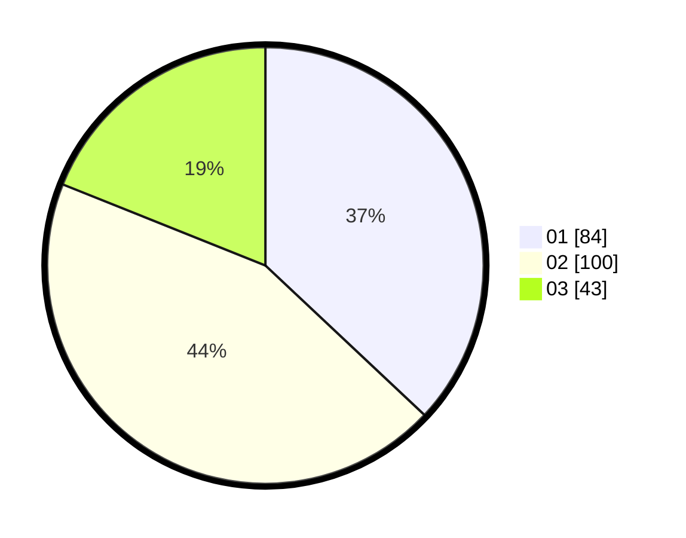

# Hasil

Hasil perolehan suara paslon dapat dilihat pada file paslon-01.txt, paslon-02.txt, dan paslon-03.txt.

Jika tidak ada, artinya data tersebut belum ada pada SIREKAP.

## Perolehan Suara

 * Paslon 01: **84**.
 * Paslon 02: **100**.
 * Paslon 03: **43**.

## Foto C Plano

https://sirekap-obj-formc.kpu.go.id/ba1d/pemilu/ppwp/31/72/02/10/06/3172021006040-20240215-015732--951e4a6d-5fec-41b1-abdf-ee6b570cf8ac.jpg

https://sirekap-obj-formc.kpu.go.id/ba1d/pemilu/ppwp/31/72/02/10/06/3172021006040-20240215-015744--5cb6a6fe-4558-4daf-95cb-ed1be497328f.jpg

https://sirekap-obj-formc.kpu.go.id/ba1d/pemilu/ppwp/31/72/02/10/06/3172021006040-20240214-185537--c7359660-812a-42e4-81f3-6b7c7134d074.jpg

## DATA PEMILIH TETAP

Jumlah pemilih dalam DPT: **299**.
 * L: **150**.
 * P: **149**.

## DATA PENGGUNA HAK PILIH

Jumlah pengguna hak pilih dalam DPT: **239**.
 * L: **119**.
 * P: **120**.

Jumlah pengguna hak pilih dalam DPTb: **0**.
 * L: **0**.
 * P: **0**.

Jumlah pengguna hak pilih dalam DPK: **0**.
 * L: **0**.
 * P: **0**.

Jumlah pengguna hak pilih: **239**.
 * L: **119**.
 * P: **120**.

## JUMLAH SUARA SAH DAN TIDAK SAH

JUMLAH SELURUH SUARA SAH: **227**.

JUMLAH SUARA TIDAK SAH: **12**.

JUMLAH SELURUH SUARA SAH DAN SUARA TIDAK SAH: **239**.
