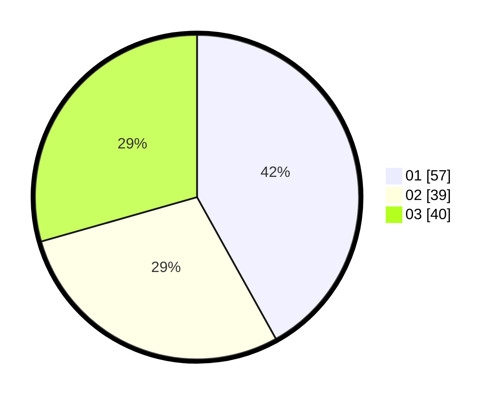

# Hasil

Hasil perolehan suara paslon dapat dilihat pada file paslon-01.txt, paslon-02.txt, dan paslon-03.txt.

Jika tidak ada, artinya data tersebut belum ada pada SIREKAP.

## Perolehan Suara

 * Paslon 01: **57**.
 * Paslon 02: **39**.
 * Paslon 03: **40**.

## Foto C Plano

https://sirekap-obj-formc.kpu.go.id/9d52/pemilu/ppwp/31/72/02/10/06/3172021006054-20240214-185143--7dc3a1be-49b2-4d66-850d-8293c24e7854.jpg

https://sirekap-obj-formc.kpu.go.id/9d52/pemilu/ppwp/31/72/02/10/06/3172021006054-20240214-185259--49c89f8a-5859-4cf9-af5e-c1e495d3c29c.jpg

https://sirekap-obj-formc.kpu.go.id/9d52/pemilu/ppwp/31/72/02/10/06/3172021006054-20240214-185156--4034f024-79b9-4285-b1a2-1686d4bb6700.jpg

## DATA PEMILIH TETAP

Jumlah pemilih dalam DPT: **300**.
 * L: **152**.
 * P: **148**.

## DATA PENGGUNA HAK PILIH

Jumlah pengguna hak pilih dalam DPT: **229**.
 * L: **116**.
 * P: **113**.

Jumlah pengguna hak pilih dalam DPTb: **229**.
 * L: **116**.
 * P: **113**.

Jumlah pengguna hak pilih dalam DPK: **5**.
 * L: **2**.
 * P: **3**.

Jumlah pengguna hak pilih: **236**.
 * L: **119**.
 * P: **117**.

## JUMLAH SUARA SAH DAN TIDAK SAH

JUMLAH SELURUH SUARA SAH: **236**.

JUMLAH SUARA TIDAK SAH: **0**.

JUMLAH SELURUH SUARA SAH DAN SUARA TIDAK SAH: **236**.
