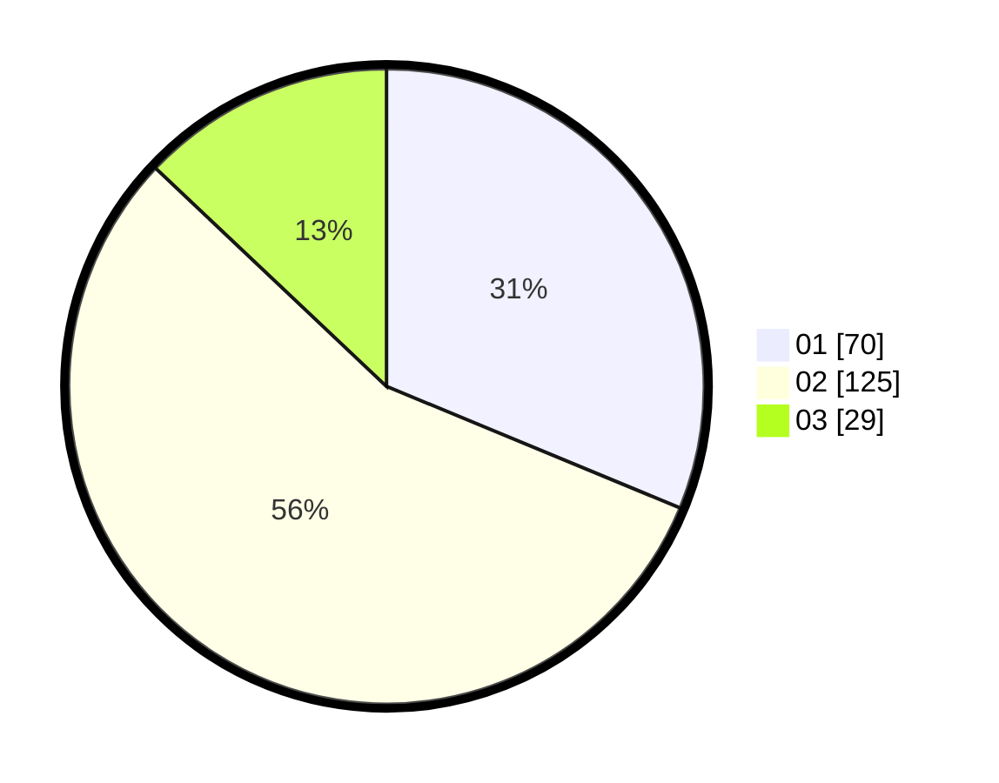

# Hasil

Hasil perolehan suara paslon dapat dilihat pada file paslon-01.txt, paslon-02.txt, dan paslon-03.txt.

Jika tidak ada, artinya data tersebut belum ada pada SIREKAP.

## Perolehan Suara

 * Paslon 01: **70**.
 * Paslon 02: **125**.
 * Paslon 03: **29**.

## Foto C Plano

https://sirekap-obj-formc.kpu.go.id/348e/pemilu/ppwp/31/72/02/10/06/3172021006057-20240217-195825--e53dd19c-f37f-4ea1-864b-f60534c44d16.jpg

https://sirekap-obj-formc.kpu.go.id/348e/pemilu/ppwp/31/72/02/10/06/3172021006057-20240217-195904--5314583b-5f7b-4083-a7cc-88e60fb1589d.jpg

https://sirekap-obj-formc.kpu.go.id/348e/pemilu/ppwp/31/72/02/10/06/3172021006057-20240217-195929--63966b77-cc27-4f28-81e1-15629b7e89ff.jpg

## DATA PEMILIH TETAP

Jumlah pemilih dalam DPT: **297**.
 * L: **144**.
 * P: **153**.

## DATA PENGGUNA HAK PILIH

Jumlah pengguna hak pilih dalam DPT: **210**.
 * L: **101**.
 * P: **109**.

Jumlah pengguna hak pilih dalam DPTb: **1**.
 * L: **1**.
 * P: **0**.

Jumlah pengguna hak pilih dalam DPK: **14**.
 * L: **5**.
 * P: **9**.

Jumlah pengguna hak pilih: **225**.
 * L: **107**.
 * P: **118**.

## JUMLAH SUARA SAH DAN TIDAK SAH

JUMLAH SELURUH SUARA SAH: **224**.

JUMLAH SUARA TIDAK SAH: **1**.

JUMLAH SELURUH SUARA SAH DAN SUARA TIDAK SAH: **225**.
