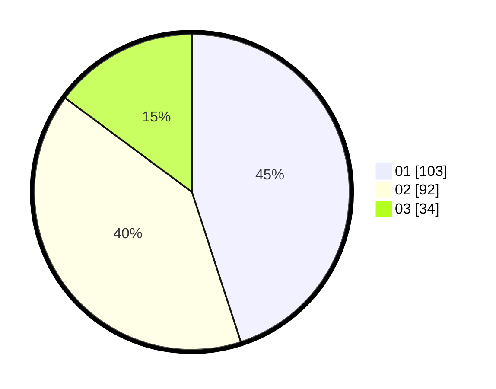

# Hasil

Hasil perolehan suara paslon dapat dilihat pada file paslon-01.txt, paslon-02.txt, dan paslon-03.txt.

Jika tidak ada, artinya data tersebut belum ada pada SIREKAP.

## Perolehan Suara

 * Paslon 01: **103**.
 * Paslon 02: **92**.
 * Paslon 03: **34**.

## Foto C Plano

https://sirekap-obj-formc.kpu.go.id/e5aa/pemilu/ppwp/31/72/02/10/06/3172021006065-20240214-200656--1470f359-9cc0-488a-98d2-41850f3c551c.jpg

https://sirekap-obj-formc.kpu.go.id/e5aa/pemilu/ppwp/31/72/02/10/06/3172021006065-20240214-193455--eb24e109-de73-4859-bd17-9f1450be3ed4.jpg

https://sirekap-obj-formc.kpu.go.id/e5aa/pemilu/ppwp/31/72/02/10/06/3172021006065-20240216-021058--6a7ad15a-646e-40e8-9eda-e5c8b8378614.jpg

## DATA PEMILIH TETAP

Jumlah pemilih dalam DPT: **293**.
 * L: **145**.
 * P: **148**.

## DATA PENGGUNA HAK PILIH

Jumlah pengguna hak pilih dalam DPT: **230**.
 * L: **113**.
 * P: **117**.

Jumlah pengguna hak pilih dalam DPTb: **0**.
 * L: **0**.
 * P: **0**.

Jumlah pengguna hak pilih dalam DPK: **3**.
 * L: **2**.
 * P: **1**.

Jumlah pengguna hak pilih: **233**.
 * L: **115**.
 * P: **118**.

## JUMLAH SUARA SAH DAN TIDAK SAH

JUMLAH SELURUH SUARA SAH: **229**.

JUMLAH SUARA TIDAK SAH: **4**.

JUMLAH SELURUH SUARA SAH DAN SUARA TIDAK SAH: **233**.
