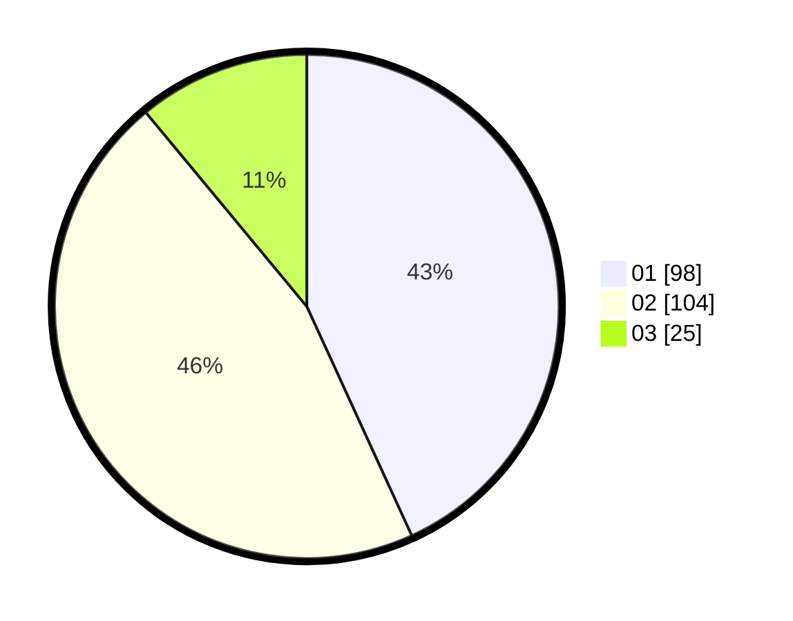

# Hasil

Hasil perolehan suara paslon dapat dilihat pada file paslon-01.txt, paslon-02.txt, dan paslon-03.txt.

Jika tidak ada, artinya data tersebut belum ada pada SIREKAP.

## Perolehan Suara

 * Paslon 01: **98**.
 * Paslon 02: **104**.
 * Paslon 03: **25**.

## Foto C Plano

https://sirekap-obj-formc.kpu.go.id/2af9/pemilu/ppwp/31/72/02/10/06/3172021006066-20240215-213349--71954dcc-44a4-4095-928f-931bdf90a1ac.jpg

https://sirekap-obj-formc.kpu.go.id/2af9/pemilu/ppwp/31/72/02/10/06/3172021006066-20240215-213350--89b1e527-1bf3-40b9-9309-a19e1ecf000d.jpg

https://sirekap-obj-formc.kpu.go.id/2af9/pemilu/ppwp/31/72/02/10/06/3172021006066-20240215-213350--3f834d24-3b17-43a7-8ac3-3e9ca1937bdc.jpg

## DATA PEMILIH TETAP

Jumlah pemilih dalam DPT: **293**.
 * L: **146**.
 * P: **147**.

## DATA PENGGUNA HAK PILIH

Jumlah pengguna hak pilih dalam DPT: **228**.
 * L: **104**.
 * P: **124**.

Jumlah pengguna hak pilih dalam DPTb: **0**.
 * L: **0**.
 * P: **0**.

Jumlah pengguna hak pilih dalam DPK: **2**.
 * L: **1**.
 * P: **1**.

Jumlah pengguna hak pilih: **230**.
 * L: **105**.
 * P: **125**.

## JUMLAH SUARA SAH DAN TIDAK SAH

JUMLAH SELURUH SUARA SAH: **227**.

JUMLAH SUARA TIDAK SAH: **3**.

JUMLAH SELURUH SUARA SAH DAN SUARA TIDAK SAH: **230**.
