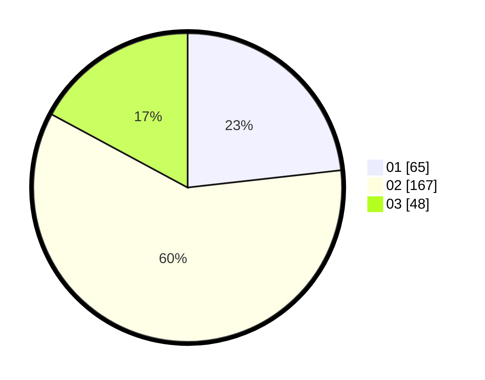

# Hasil

Hasil perolehan suara paslon dapat dilihat pada file paslon-01.txt, paslon-02.txt, dan paslon-03.txt.

Jika tidak ada, artinya data tersebut belum ada pada SIREKAP.

## Perolehan Suara

 * Paslon 01: **65**.
 * Paslon 02: **167**.
 * Paslon 03: **48**.

## Foto C Plano

https://sirekap-obj-formc.kpu.go.id/9ce9/pemilu/ppwp/31/72/02/10/06/3172021006072-20240218-103701--6ac5b165-28d0-4543-9777-fc8e1088af4a.jpg

https://sirekap-obj-formc.kpu.go.id/9ce9/pemilu/ppwp/31/72/02/10/06/3172021006072-20240218-104009--8919cdc3-7485-45ee-b322-589356bd87d2.jpg

https://sirekap-obj-formc.kpu.go.id/9ce9/pemilu/ppwp/31/72/02/10/06/3172021006072-20240218-104125--8c0ea3a0-3dae-4278-a74c-cb93e5458708.jpg

## DATA PEMILIH TETAP

Jumlah pemilih dalam DPT: **797**.
 * L: **141**.
 * P: **152**.

## DATA PENGGUNA HAK PILIH

Jumlah pengguna hak pilih dalam DPT: **271**.
 * L: **104**.
 * P: **122**.

Jumlah pengguna hak pilih dalam DPTb: **8**.
 * L: **0**.
 * P: **0**.

Jumlah pengguna hak pilih dalam DPK: **7**.
 * L: **2**.
 * P: **1**.

Jumlah pengguna hak pilih: **274**.
 * L: **113**.
 * P: **127**.

## JUMLAH SUARA SAH DAN TIDAK SAH

JUMLAH SELURUH SUARA SAH: **270**.

JUMLAH SUARA TIDAK SAH: **884**.

JUMLAH SELURUH SUARA SAH DAN SUARA TIDAK SAH: **277**.
