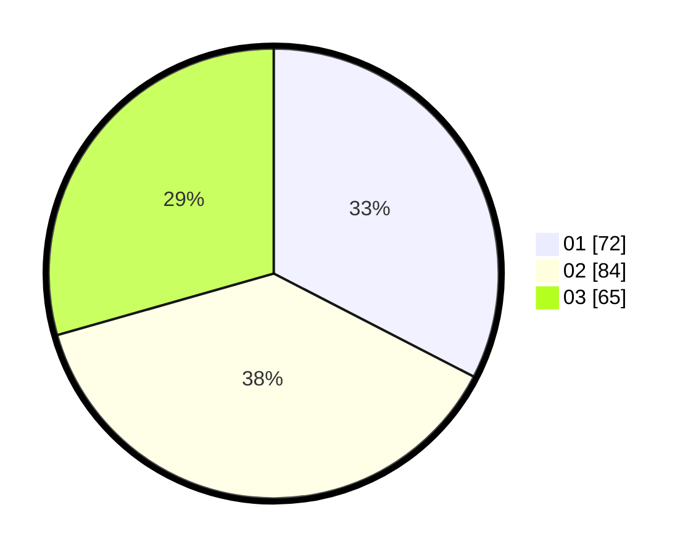

# Hasil

Hasil perolehan suara paslon dapat dilihat pada file paslon-01.txt, paslon-02.txt, dan paslon-03.txt.

Jika tidak ada, artinya data tersebut belum ada pada SIREKAP.

## Perolehan Suara

 * Paslon 01: **72**.
 * Paslon 02: **84**.
 * Paslon 03: **65**.

## Foto C Plano

https://sirekap-obj-formc.kpu.go.id/a33a/pemilu/ppwp/31/72/02/10/06/3172021006077-20240214-204015--ab4d811e-2361-489b-ac55-3a20ac05a649.jpg

https://sirekap-obj-formc.kpu.go.id/a33a/pemilu/ppwp/31/72/02/10/06/3172021006077-20240214-204020--90f65abb-5a78-47ff-8c1d-5091a5328dbb.jpg

https://sirekap-obj-formc.kpu.go.id/a33a/pemilu/ppwp/31/72/02/10/06/3172021006077-20240214-204025--249cfc2b-2c4b-4d78-8b89-bba442ffd06b.jpg

## DATA PEMILIH TETAP

Jumlah pemilih dalam DPT: **296**.
 * L: **151**.
 * P: **145**.

## DATA PENGGUNA HAK PILIH

Jumlah pengguna hak pilih dalam DPT: **224**.
 * L: **112**.
 * P: **112**.

Jumlah pengguna hak pilih dalam DPTb: **0**.
 * L: **0**.
 * P: **0**.

Jumlah pengguna hak pilih dalam DPK: **0**.
 * L: **0**.
 * P: **0**.

Jumlah pengguna hak pilih: **224**.
 * L: **112**.
 * P: **112**.

## JUMLAH SUARA SAH DAN TIDAK SAH

JUMLAH SELURUH SUARA SAH: **221**.

JUMLAH SUARA TIDAK SAH: **3**.

JUMLAH SELURUH SUARA SAH DAN SUARA TIDAK SAH: **224**.
