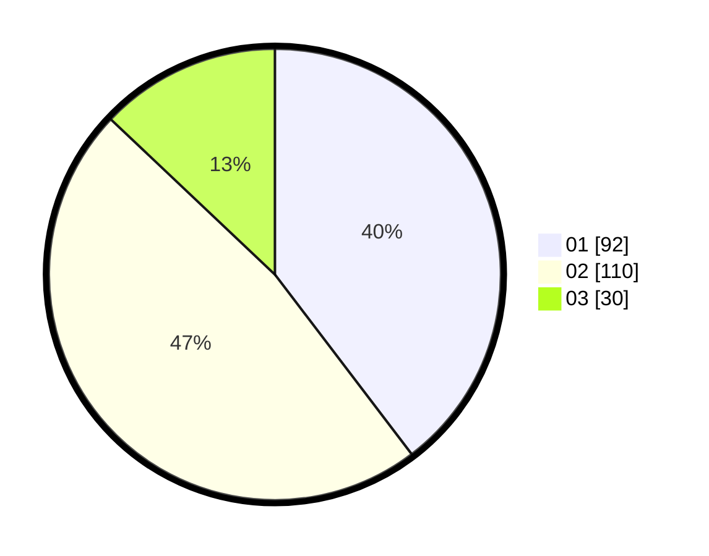

# Hasil

Hasil perolehan suara paslon dapat dilihat pada file paslon-01.txt, paslon-02.txt, dan paslon-03.txt.

Jika tidak ada, artinya data tersebut belum ada pada SIREKAP.

## Perolehan Suara

 * Paslon 01: **92**.
 * Paslon 02: **110**.
 * Paslon 03: **30**.

## Foto C Plano

https://sirekap-obj-formc.kpu.go.id/0c3f/pemilu/ppwp/31/72/02/10/06/3172021006080-20240216-143309--7831e584-b240-489f-845b-23618b441ef3.jpg

https://sirekap-obj-formc.kpu.go.id/0c3f/pemilu/ppwp/31/72/02/10/06/3172021006080-20240216-143310--0954b585-d8a6-4b80-a04c-8abf598c564b.jpg

https://sirekap-obj-formc.kpu.go.id/0c3f/pemilu/ppwp/31/72/02/10/06/3172021006080-20240216-143309--d2a2f0a9-07f9-4749-bbd7-53bacb8645ab.jpg

## DATA PEMILIH TETAP

Jumlah pemilih dalam DPT: **289**.
 * L: **139**.
 * P: **150**.

## DATA PENGGUNA HAK PILIH

Jumlah pengguna hak pilih dalam DPT: **234**.
 * L: **110**.
 * P: **124**.

Jumlah pengguna hak pilih dalam DPTb: **0**.
 * L: **0**.
 * P: **0**.

Jumlah pengguna hak pilih dalam DPK: **2**.
 * L: **2**.
 * P: **0**.

Jumlah pengguna hak pilih: **236**.
 * L: **112**.
 * P: **124**.

## JUMLAH SUARA SAH DAN TIDAK SAH

JUMLAH SELURUH SUARA SAH: **232**.

JUMLAH SUARA TIDAK SAH: **4**.

JUMLAH SELURUH SUARA SAH DAN SUARA TIDAK SAH: **236**.
