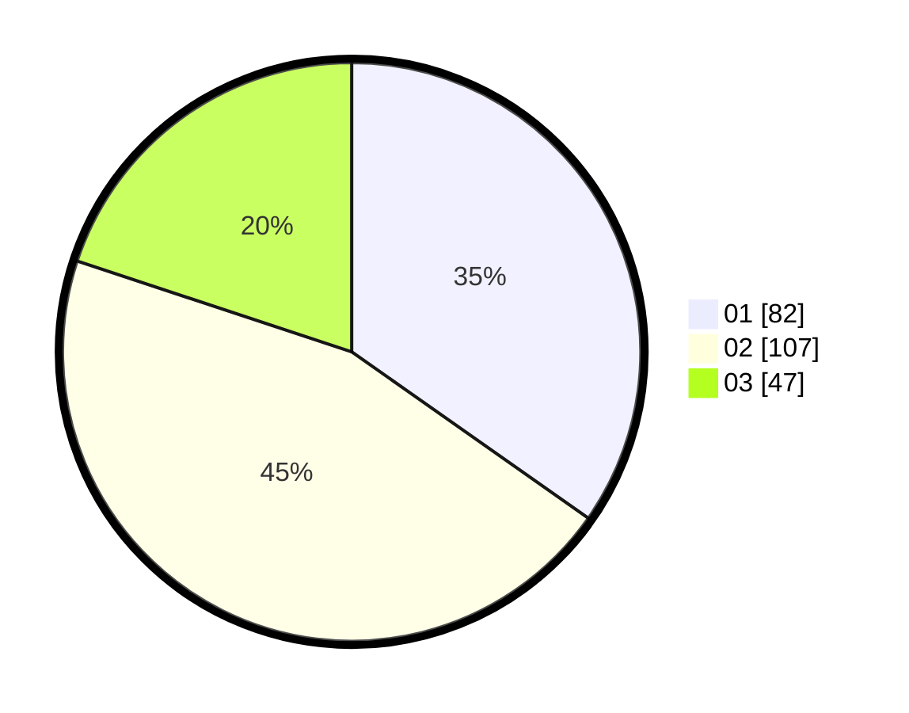

# Hasil

Hasil perolehan suara paslon dapat dilihat pada file paslon-01.txt, paslon-02.txt, dan paslon-03.txt.

Jika tidak ada, artinya data tersebut belum ada pada SIREKAP.

## Perolehan Suara

 * Paslon 01: **82**.
 * Paslon 02: **107**.
 * Paslon 03: **47**.

## Foto C Plano

https://sirekap-obj-formc.kpu.go.id/1abb/pemilu/ppwp/31/72/02/10/06/3172021006081-20240214-192037--07d25d97-c243-4fd9-86a6-1253148ad09d.jpg

https://sirekap-obj-formc.kpu.go.id/1abb/pemilu/ppwp/31/72/02/10/06/3172021006081-20240214-160122--d6777192-e064-4b2c-ab8e-cb85e9df45ab.jpg
