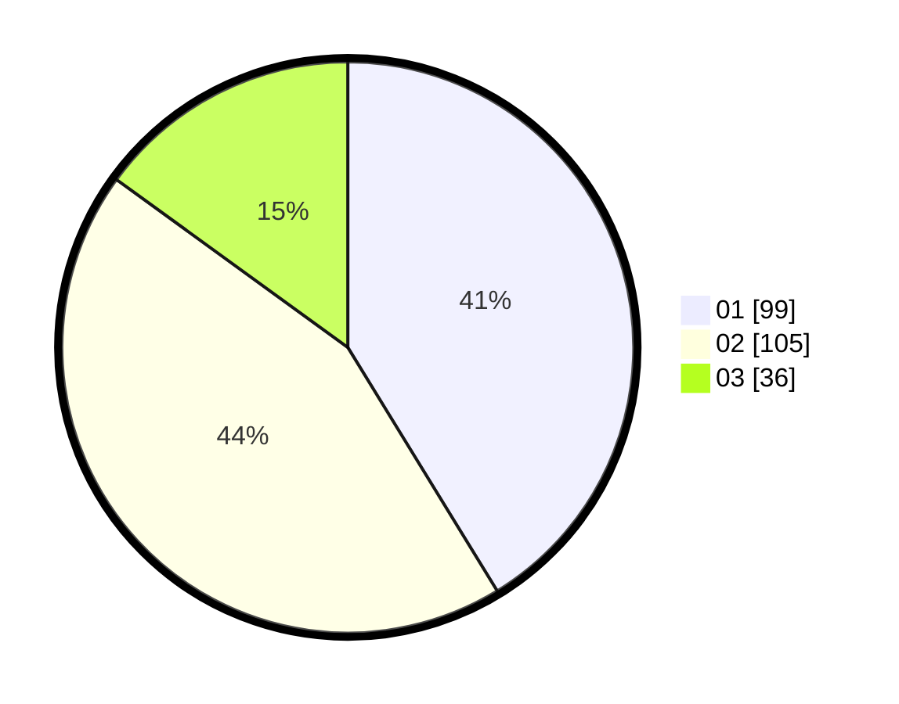

# Hasil

Hasil perolehan suara paslon dapat dilihat pada file paslon-01.txt, paslon-02.txt, dan paslon-03.txt.

Jika tidak ada, artinya data tersebut belum ada pada SIREKAP.

## Perolehan Suara

 * Paslon 01: **99**.
 * Paslon 02: **105**.
 * Paslon 03: **36**.

## Foto C Plano

https://sirekap-obj-formc.kpu.go.id/36c9/pemilu/ppwp/31/72/02/10/06/3172021006084-20240214-155436--20004fbf-0277-4d07-9092-a9bc8e107594.jpg

https://sirekap-obj-formc.kpu.go.id/36c9/pemilu/ppwp/31/72/02/10/06/3172021006084-20240214-155451--c69e335d-f3fc-4c6b-be96-65b10d7d4365.jpg

https://sirekap-obj-formc.kpu.go.id/36c9/pemilu/ppwp/31/72/02/10/06/3172021006084-20240214-155505--a8240a57-2411-4764-b036-aa149550377e.jpg

## DATA PEMILIH TETAP

Jumlah pemilih dalam DPT: **295**.
 * L: **151**.
 * P: **144**.

## DATA PENGGUNA HAK PILIH

Jumlah pengguna hak pilih dalam DPT: **228**.
 * L: **116**.
 * P: **112**.

Jumlah pengguna hak pilih dalam DPTb: **15**.
 * L: **11**.
 * P: **4**.

Jumlah pengguna hak pilih dalam DPK: **0**.
 * L: **0**.
 * P: **0**.

Jumlah pengguna hak pilih: **243**.
 * L: **127**.
 * P: **116**.

## JUMLAH SUARA SAH DAN TIDAK SAH

JUMLAH SELURUH SUARA SAH: **240**.

JUMLAH SUARA TIDAK SAH: **3**.

JUMLAH SELURUH SUARA SAH DAN SUARA TIDAK SAH: **243**.
