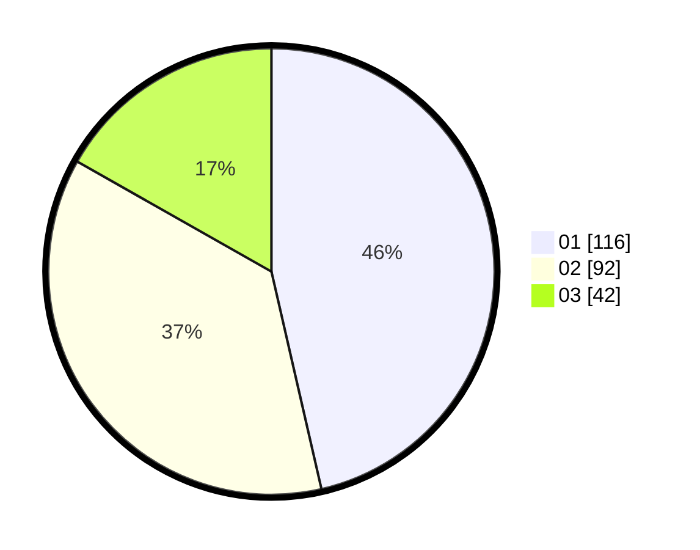

# Hasil

Hasil perolehan suara paslon dapat dilihat pada file paslon-01.txt, paslon-02.txt, dan paslon-03.txt.

Jika tidak ada, artinya data tersebut belum ada pada SIREKAP.

## Perolehan Suara

 * Paslon 01: **116**.
 * Paslon 02: **92**.
 * Paslon 03: **42**.

## Foto C Plano

https://sirekap-obj-formc.kpu.go.id/0762/pemilu/ppwp/31/72/02/10/06/3172021006089-20240215-205651--d02ceb20-0958-4313-aca5-f58d696e45c4.jpg

https://sirekap-obj-formc.kpu.go.id/0762/pemilu/ppwp/31/72/02/10/06/3172021006089-20240215-205653--8a2c85e8-8c31-412c-b901-8698ab99162d.jpg

https://sirekap-obj-formc.kpu.go.id/0762/pemilu/ppwp/31/72/02/10/06/3172021006089-20240215-205652--e0d8b6fe-823e-41b7-868f-6f0b9de8764f.jpg

## DATA PEMILIH TETAP

Jumlah pemilih dalam DPT: **297**.
 * L: **146**.
 * P: **151**.

## DATA PENGGUNA HAK PILIH

Jumlah pengguna hak pilih dalam DPT: **247**.
 * L: **119**.
 * P: **128**.

Jumlah pengguna hak pilih dalam DPTb: **5**.
 * L: **2**.
 * P: **3**.

Jumlah pengguna hak pilih dalam DPK: **0**.
 * L: **0**.
 * P: **0**.

Jumlah pengguna hak pilih: **252**.
 * L: **121**.
 * P: **131**.

## JUMLAH SUARA SAH DAN TIDAK SAH

JUMLAH SELURUH SUARA SAH: **250**.

JUMLAH SUARA TIDAK SAH: **2**.

JUMLAH SELURUH SUARA SAH DAN SUARA TIDAK SAH: **252**.
