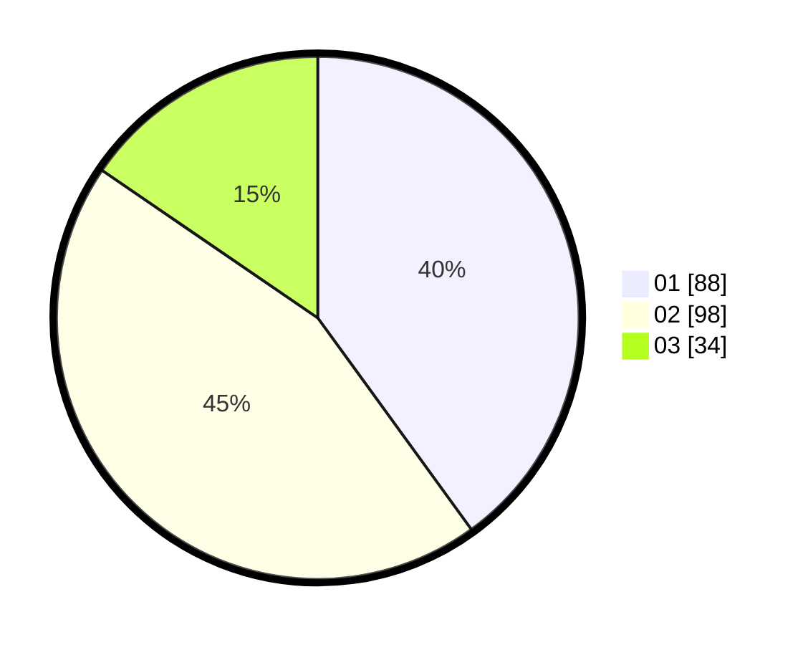

# Hasil

Hasil perolehan suara paslon dapat dilihat pada file paslon-01.txt, paslon-02.txt, dan paslon-03.txt.

Jika tidak ada, artinya data tersebut belum ada pada SIREKAP.

## Perolehan Suara

 * Paslon 01: **88**.
 * Paslon 02: **98**.
 * Paslon 03: **34**.

## Foto C Plano

https://sirekap-obj-formc.kpu.go.id/8222/pemilu/ppwp/31/72/02/10/06/3172021006097-20240216-004554--6b9f2e80-25c8-46f6-9ea5-194dd01cfc1e.jpg

https://sirekap-obj-formc.kpu.go.id/8222/pemilu/ppwp/31/72/02/10/06/3172021006097-20240216-004606--9bff8528-db28-4aac-8e4a-189c86c2c25e.jpg

https://sirekap-obj-formc.kpu.go.id/8222/pemilu/ppwp/31/72/02/10/06/3172021006097-20240216-004601--ad38d794-49c0-4edd-8ae8-8e5a73cac4ec.jpg

## DATA PEMILIH TETAP

Jumlah pemilih dalam DPT: **293**.
 * L: **140**.
 * P: **153**.

## DATA PENGGUNA HAK PILIH

Jumlah pengguna hak pilih dalam DPT: **224**.
 * L: **113**.
 * P: **111**.

Jumlah pengguna hak pilih dalam DPTb: **0**.
 * L: **0**.
 * P: **0**.

Jumlah pengguna hak pilih dalam DPK: **0**.
 * L: **0**.
 * P: **0**.

Jumlah pengguna hak pilih: **224**.
 * L: **113**.
 * P: **111**.

## JUMLAH SUARA SAH DAN TIDAK SAH

JUMLAH SELURUH SUARA SAH: **220**.

JUMLAH SUARA TIDAK SAH: **4**.

JUMLAH SELURUH SUARA SAH DAN SUARA TIDAK SAH: **224**.
