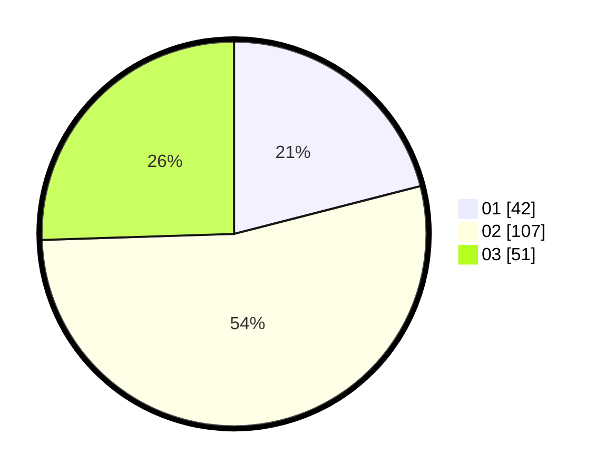

# Hasil

Hasil perolehan suara paslon dapat dilihat pada file paslon-01.txt, paslon-02.txt, dan paslon-03.txt.

Jika tidak ada, artinya data tersebut belum ada pada SIREKAP.

## Perolehan Suara

 * Paslon 01: **42**.
 * Paslon 02: **107**.
 * Paslon 03: **51**.

## Foto C Plano

https://sirekap-obj-formc.kpu.go.id/bfd9/pemilu/ppwp/31/72/02/10/06/3172021006098-20240215-204634--7df124a4-324a-4218-91aa-13ae5c702f61.jpg

https://sirekap-obj-formc.kpu.go.id/bfd9/pemilu/ppwp/31/72/02/10/06/3172021006098-20240215-204637--36f76e49-7b89-40e6-8e61-abdd9a8d2df1.jpg

https://sirekap-obj-formc.kpu.go.id/bfd9/pemilu/ppwp/31/72/02/10/06/3172021006098-20240215-204636--1c11de4d-4ef9-49d2-9f74-15e11bb65659.jpg

## DATA PEMILIH TETAP

Jumlah pemilih dalam DPT: **293**.
 * L: **140**.
 * P: **153**.

## DATA PENGGUNA HAK PILIH

Jumlah pengguna hak pilih dalam DPT: **199**.
 * L: **93**.
 * P: **106**.

Jumlah pengguna hak pilih dalam DPTb: **0**.
 * L: **0**.
 * P: **0**.

Jumlah pengguna hak pilih dalam DPK: **5**.
 * L: **1**.
 * P: **4**.

Jumlah pengguna hak pilih: **204**.
 * L: **94**.
 * P: **110**.

## JUMLAH SUARA SAH DAN TIDAK SAH

JUMLAH SELURUH SUARA SAH: **200**.

JUMLAH SUARA TIDAK SAH: **4**.

JUMLAH SELURUH SUARA SAH DAN SUARA TIDAK SAH: **204**.
