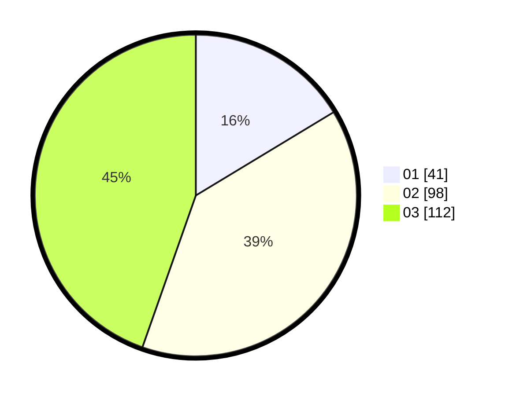

# Hasil

Hasil perolehan suara paslon dapat dilihat pada file paslon-01.txt, paslon-02.txt, dan paslon-03.txt.

Jika tidak ada, artinya data tersebut belum ada pada SIREKAP.

## Perolehan Suara

 * Paslon 01: **41**.
 * Paslon 02: **98**.
 * Paslon 03: **112**.

## Foto C Plano

https://sirekap-obj-formc.kpu.go.id/dd7c/pemilu/ppwp/31/72/02/10/06/3172021006108-20240214-155439--c568dae3-8dfa-4d43-8c08-ae214963a6a2.jpg

https://sirekap-obj-formc.kpu.go.id/dd7c/pemilu/ppwp/31/72/02/10/06/3172021006108-20240214-155449--083ae238-c6ce-4bd3-8c8f-2b3d01b86e28.jpg

https://sirekap-obj-formc.kpu.go.id/dd7c/pemilu/ppwp/31/72/02/10/06/3172021006108-20240214-155500--ae26bdcc-eaf0-4b25-99a7-008e96506c1c.jpg

## DATA PEMILIH TETAP

Jumlah pemilih dalam DPT: **298**.
 * L: **130**.
 * P: **168**.

## DATA PENGGUNA HAK PILIH

Jumlah pengguna hak pilih dalam DPT: **246**.
 * L: **103**.
 * P: **143**.

Jumlah pengguna hak pilih dalam DPTb: **7**.
 * L: **2**.
 * P: **5**.

Jumlah pengguna hak pilih dalam DPK: **2**.
 * L: **0**.
 * P: **2**.

Jumlah pengguna hak pilih: **255**.
 * L: **105**.
 * P: **150**.

## JUMLAH SUARA SAH DAN TIDAK SAH

JUMLAH SELURUH SUARA SAH: **251**.

JUMLAH SUARA TIDAK SAH: **4**.

JUMLAH SELURUH SUARA SAH DAN SUARA TIDAK SAH: **255**.
