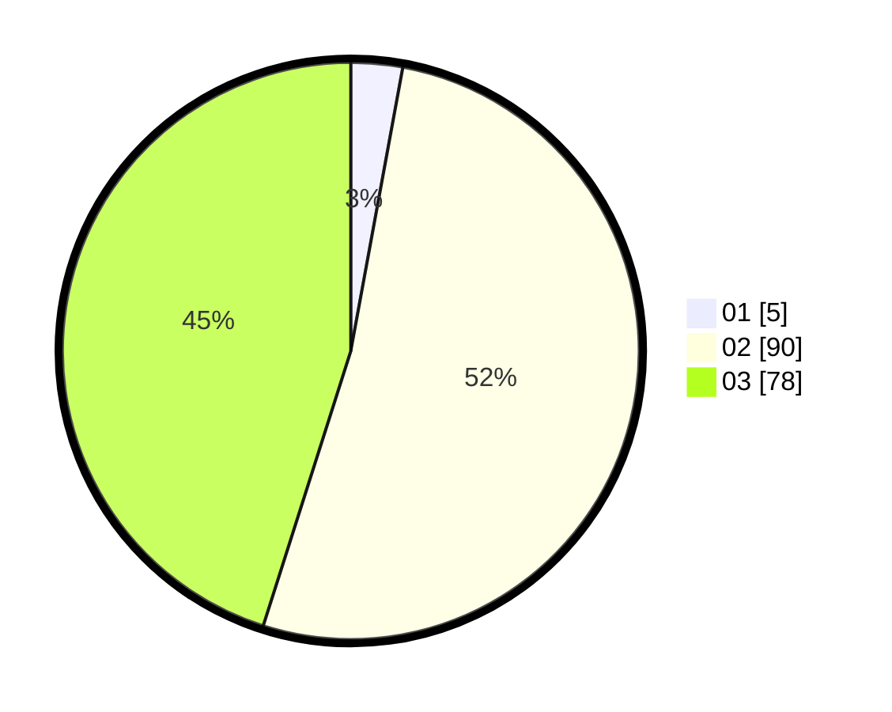

# Hasil

Hasil perolehan suara paslon dapat dilihat pada file paslon-01.txt, paslon-02.txt, dan paslon-03.txt.

Jika tidak ada, artinya data tersebut belum ada pada SIREKAP.

## Perolehan Suara

 * Paslon 01: **5**.
 * Paslon 02: **90**.
 * Paslon 03: **78**.

## Foto C Plano

https://sirekap-obj-formc.kpu.go.id/06d8/pemilu/ppwp/31/72/02/10/06/3172021006150-20240214-195612--085b0cc3-e98e-4586-8bb8-ffa60ab2958b.jpg

https://sirekap-obj-formc.kpu.go.id/06d8/pemilu/ppwp/31/72/02/10/06/3172021006150-20240214-191749--c7f2604c-e1ca-42fb-ac52-bf883abfc367.jpg

https://sirekap-obj-formc.kpu.go.id/06d8/pemilu/ppwp/31/72/02/10/06/3172021006150-20240214-195854--97e65c36-a3e4-4085-97bf-2caa26548aad.jpg

## DATA PEMILIH TETAP

Jumlah pemilih dalam DPT: **225**.
 * L: **113**.
 * P: **112**.

## DATA PENGGUNA HAK PILIH

Jumlah pengguna hak pilih dalam DPT: **170**.
 * L: **88**.
 * P: **82**.

Jumlah pengguna hak pilih dalam DPTb: **4**.
 * L: **2**.
 * P: **2**.

Jumlah pengguna hak pilih dalam DPK: **2**.
 * L: **1**.
 * P: **1**.

Jumlah pengguna hak pilih: **176**.
 * L: **91**.
 * P: **85**.

## JUMLAH SUARA SAH DAN TIDAK SAH

JUMLAH SELURUH SUARA SAH: **173**.

JUMLAH SUARA TIDAK SAH: **3**.

JUMLAH SELURUH SUARA SAH DAN SUARA TIDAK SAH: **176**.
