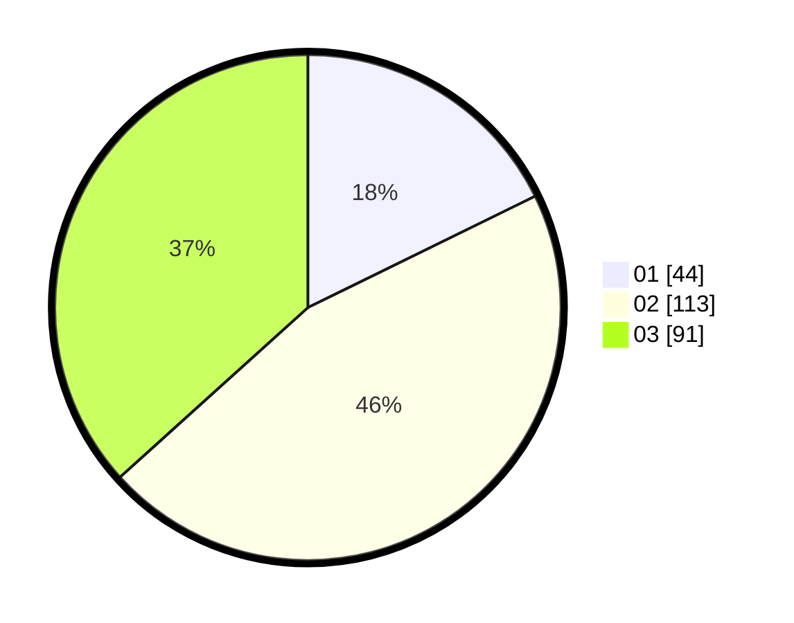

# Hasil

Hasil perolehan suara paslon dapat dilihat pada file paslon-01.txt, paslon-02.txt, dan paslon-03.txt.

Jika tidak ada, artinya data tersebut belum ada pada SIREKAP.

## Perolehan Suara

 * Paslon 01: **44**.
 * Paslon 02: **113**.
 * Paslon 03: **91**.

## Foto C Plano

https://sirekap-obj-formc.kpu.go.id/1282/pemilu/ppwp/31/72/02/10/06/3172021006163-20240214-195218--7b50733e-d50d-4189-938e-cbd80eb2acbc.jpg

https://sirekap-obj-formc.kpu.go.id/1282/pemilu/ppwp/31/72/02/10/06/3172021006163-20240214-195306--5bf5235f-239e-4220-8ec3-70ef5da5e768.jpg

https://sirekap-obj-formc.kpu.go.id/1282/pemilu/ppwp/31/72/02/10/06/3172021006163-20240214-195352--fabc834b-d5a7-4d0a-9b1c-2196d1ea3f6e.jpg

## DATA PEMILIH TETAP

Jumlah pemilih dalam DPT: **297**.
 * L: **138**.
 * P: **159**.

## DATA PENGGUNA HAK PILIH

Jumlah pengguna hak pilih dalam DPT: **254**.
 * L: **119**.
 * P: **135**.

Jumlah pengguna hak pilih dalam DPTb: **0**.
 * L: **0**.
 * P: **0**.

Jumlah pengguna hak pilih dalam DPK: **9**.
 * L: **1**.
 * P: **8**.

Jumlah pengguna hak pilih: **263**.
 * L: **120**.
 * P: **143**.

## JUMLAH SUARA SAH DAN TIDAK SAH

JUMLAH SELURUH SUARA SAH: **248**.

JUMLAH SUARA TIDAK SAH: **15**.

JUMLAH SELURUH SUARA SAH DAN SUARA TIDAK SAH: **263**.
