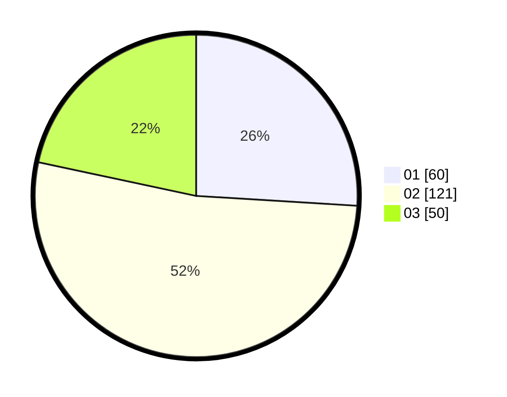

# Hasil

Hasil perolehan suara paslon dapat dilihat pada file paslon-01.txt, paslon-02.txt, dan paslon-03.txt.

Jika tidak ada, artinya data tersebut belum ada pada SIREKAP.

## Perolehan Suara

 * Paslon 01: **60**.
 * Paslon 02: **121**.
 * Paslon 03: **50**.

## Foto C Plano

https://sirekap-obj-formc.kpu.go.id/16f2/pemilu/ppwp/31/72/02/10/06/3172021006164-20240214-184538--f451d019-a03d-4d0a-8b12-54df55a8265e.jpg

https://sirekap-obj-formc.kpu.go.id/16f2/pemilu/ppwp/31/72/02/10/06/3172021006164-20240214-185205--54e9a569-394e-4f7b-b437-fe1e394c6fd4.jpg

https://sirekap-obj-formc.kpu.go.id/16f2/pemilu/ppwp/31/72/02/10/06/3172021006164-20240214-192956--873c0e80-34ff-45e2-a5d2-69a3505534c4.jpg

## DATA PEMILIH TETAP

Jumlah pemilih dalam DPT: **294**.
 * L: **165**.
 * P: **129**.

## DATA PENGGUNA HAK PILIH

Jumlah pengguna hak pilih dalam DPT: **231**.
 * L: **97**.
 * P: **134**.

Jumlah pengguna hak pilih dalam DPTb: **2**.
 * L: **1**.
 * P: **1**.

Jumlah pengguna hak pilih dalam DPK: **1**.
 * L: **1**.
 * P: **0**.

Jumlah pengguna hak pilih: **234**.
 * L: **99**.
 * P: **135**.

## JUMLAH SUARA SAH DAN TIDAK SAH

JUMLAH SELURUH SUARA SAH: **231**.

JUMLAH SUARA TIDAK SAH: **3**.

JUMLAH SELURUH SUARA SAH DAN SUARA TIDAK SAH: **234**.
