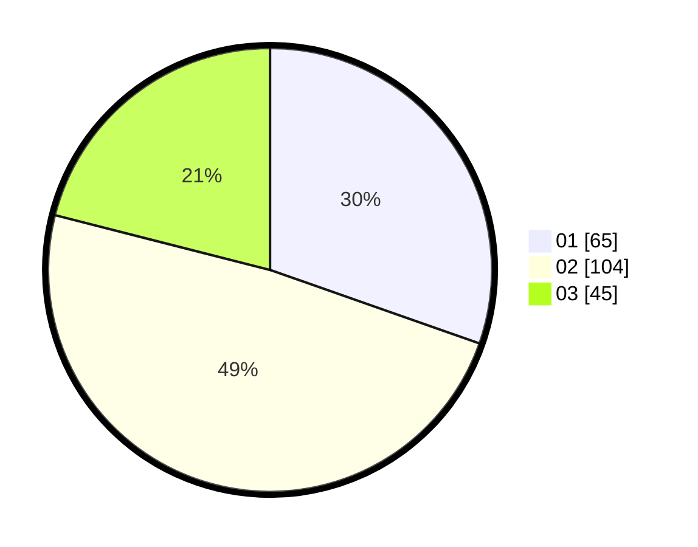

# Hasil

Hasil perolehan suara paslon dapat dilihat pada file paslon-01.txt, paslon-02.txt, dan paslon-03.txt.

Jika tidak ada, artinya data tersebut belum ada pada SIREKAP.

## Perolehan Suara

 * Paslon 01: **65**.
 * Paslon 02: **104**.
 * Paslon 03: **45**.

## Foto C Plano

https://sirekap-obj-formc.kpu.go.id/8dff/pemilu/ppwp/31/72/02/10/06/3172021006188-20240214-231835--aeabdb79-12d9-40b0-b7bb-0f4901e9fd4f.jpg

https://sirekap-obj-formc.kpu.go.id/8dff/pemilu/ppwp/31/72/02/10/06/3172021006188-20240214-231734--ae10530a-dc58-4554-a41e-627aa9f39303.jpg

https://sirekap-obj-formc.kpu.go.id/8dff/pemilu/ppwp/31/72/02/10/06/3172021006188-20240214-231906--eaee4ca1-b94e-4efc-96e3-811042ceb8df.jpg

## DATA PEMILIH TETAP

Jumlah pemilih dalam DPT: **280**.
 * L: **138**.
 * P: **142**.

## DATA PENGGUNA HAK PILIH

Jumlah pengguna hak pilih dalam DPT: **220**.
 * L: **104**.
 * P: **116**.

Jumlah pengguna hak pilih dalam DPTb: **0**.
 * L: **0**.
 * P: **0**.

Jumlah pengguna hak pilih dalam DPK: **2**.
 * L: **0**.
 * P: **2**.

Jumlah pengguna hak pilih: **222**.
 * L: **104**.
 * P: **118**.

## JUMLAH SUARA SAH DAN TIDAK SAH

JUMLAH SELURUH SUARA SAH: **214**.

JUMLAH SUARA TIDAK SAH: **8**.

JUMLAH SELURUH SUARA SAH DAN SUARA TIDAK SAH: **222**.
