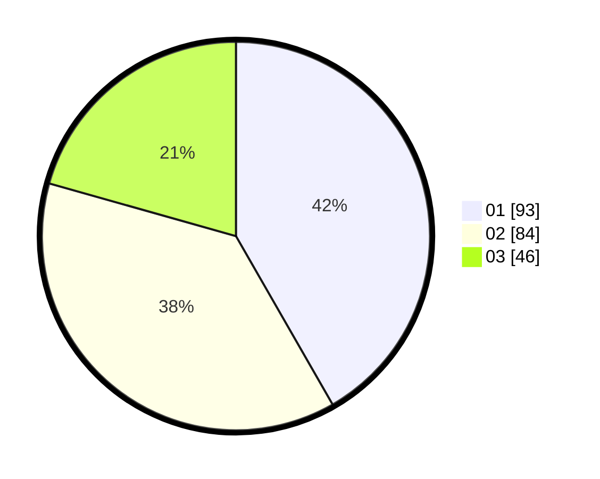

# Hasil

Hasil perolehan suara paslon dapat dilihat pada file paslon-01.txt, paslon-02.txt, dan paslon-03.txt.

Jika tidak ada, artinya data tersebut belum ada pada SIREKAP.

## Perolehan Suara

 * Paslon 01: **93**.
 * Paslon 02: **84**.
 * Paslon 03: **46**.

## Foto C Plano

https://sirekap-obj-formc.kpu.go.id/ae49/pemilu/ppwp/31/72/02/10/06/3172021006189-20240215-014155--69dda41f-db1d-4d63-bafe-980e881f7cdf.jpg

https://sirekap-obj-formc.kpu.go.id/ae49/pemilu/ppwp/31/72/02/10/06/3172021006189-20240215-014227--f59870e5-3ac4-46b8-88c8-bee75d333b5c.jpg

https://sirekap-obj-formc.kpu.go.id/ae49/pemilu/ppwp/31/72/02/10/06/3172021006189-20240215-014253--1562e6b3-7b65-4355-9f21-8660768c18ef.jpg
