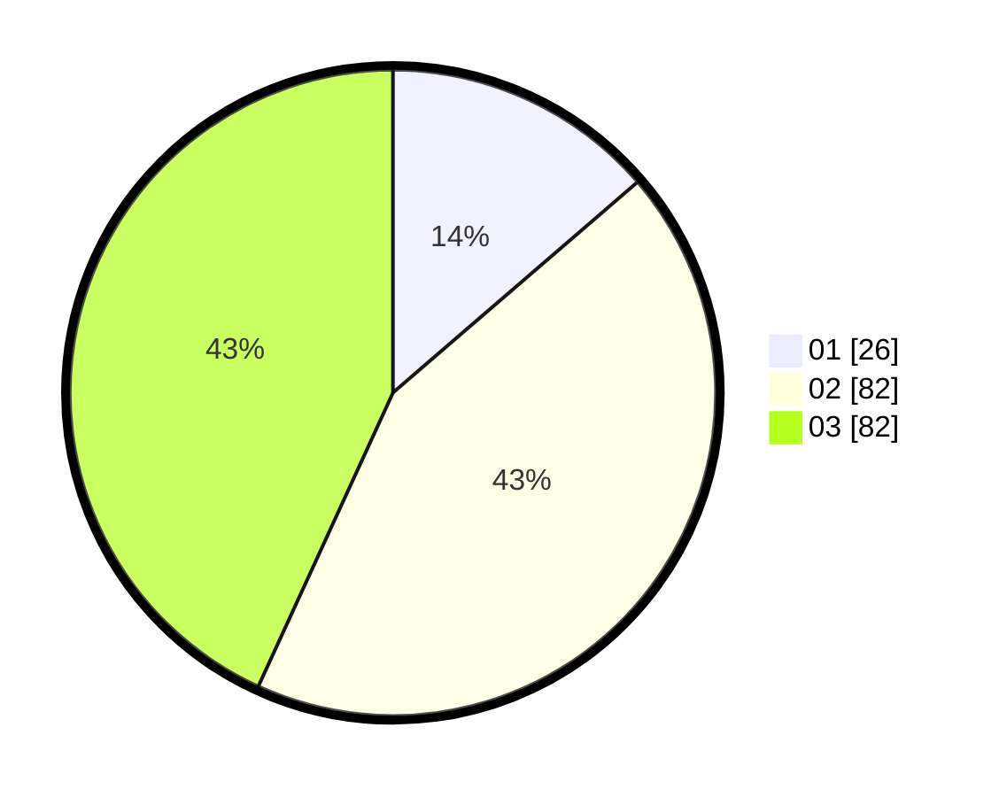

# Hasil

Hasil perolehan suara paslon dapat dilihat pada file paslon-01.txt, paslon-02.txt, dan paslon-03.txt.

Jika tidak ada, artinya data tersebut belum ada pada SIREKAP.

## Perolehan Suara

 * Paslon 01: **26**.
 * Paslon 02: **82**.
 * Paslon 03: **82**.

## Foto C Plano

https://sirekap-obj-formc.kpu.go.id/9ee0/pemilu/ppwp/31/72/02/10/06/3172021006191-20240214-193631--69ffccd1-3ad3-4dbc-811a-57456f136033.jpg

https://sirekap-obj-formc.kpu.go.id/9ee0/pemilu/ppwp/31/72/02/10/06/3172021006191-20240214-195453--49a0bce3-d0db-4f33-bfd9-4f9e82704678.jpg

https://sirekap-obj-formc.kpu.go.id/9ee0/pemilu/ppwp/31/72/02/10/06/3172021006191-20240214-192034--84834f44-e9bf-4e2c-aced-b82c47e48c00.jpg
