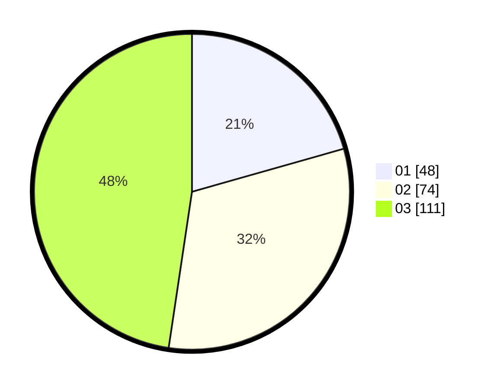

# Hasil

Hasil perolehan suara paslon dapat dilihat pada file paslon-01.txt, paslon-02.txt, dan paslon-03.txt.

Jika tidak ada, artinya data tersebut belum ada pada SIREKAP.

## Perolehan Suara

 * Paslon 01: **48**.
 * Paslon 02: **74**.
 * Paslon 03: **111**.

## Foto C Plano

https://sirekap-obj-formc.kpu.go.id/8b1b/pemilu/ppwp/31/72/02/10/06/3172021006200-20240215-010334--58c0959a-4edd-44ce-aec7-0e6752faa598.jpg

https://sirekap-obj-formc.kpu.go.id/8b1b/pemilu/ppwp/31/72/02/10/06/3172021006200-20240215-010419--f5460d54-7717-4e10-ba1e-ee3eefa3fec3.jpg

https://sirekap-obj-formc.kpu.go.id/8b1b/pemilu/ppwp/31/72/02/10/06/3172021006200-20240214-185839--57e423d4-8a36-471d-8955-0e201fb0842e.jpg

## DATA PEMILIH TETAP

Jumlah pemilih dalam DPT: **283**.
 * L: **135**.
 * P: **148**.

## DATA PENGGUNA HAK PILIH

Jumlah pengguna hak pilih dalam DPT: **227**.
 * L: **106**.
 * P: **121**.

Jumlah pengguna hak pilih dalam DPTb: **3**.
 * L: **0**.
 * P: **3**.

Jumlah pengguna hak pilih dalam DPK: **8**.
 * L: **2**.
 * P: **6**.

Jumlah pengguna hak pilih: **238**.
 * L: **108**.
 * P: **130**.

## JUMLAH SUARA SAH DAN TIDAK SAH

JUMLAH SELURUH SUARA SAH: **233**.

JUMLAH SUARA TIDAK SAH: **5**.

JUMLAH SELURUH SUARA SAH DAN SUARA TIDAK SAH: **238**.
