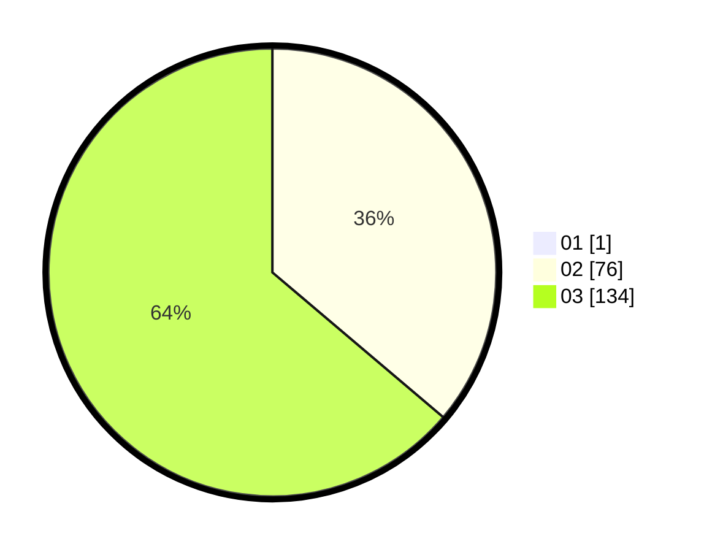

# Hasil

Hasil perolehan suara paslon dapat dilihat pada file paslon-01.txt, paslon-02.txt, dan paslon-03.txt.

Jika tidak ada, artinya data tersebut belum ada pada SIREKAP.

## Perolehan Suara

 * Paslon 01: **1**.
 * Paslon 02: **76**.
 * Paslon 03: **134**.

## Foto C Plano

https://sirekap-obj-formc.kpu.go.id/2d41/pemilu/ppwp/31/72/02/10/06/3172021006222-20240214-200742--2c6d677f-e2ba-41d7-a979-4507333b7450.jpg

https://sirekap-obj-formc.kpu.go.id/2d41/pemilu/ppwp/31/72/02/10/06/3172021006222-20240214-200908--8dd3e525-c1c6-4ac0-98fd-d0a4803b60c5.jpg

https://sirekap-obj-formc.kpu.go.id/2d41/pemilu/ppwp/31/72/02/10/06/3172021006222-20240214-201005--48a2febe-6c5f-4cbd-8826-a338347c58ec.jpg

## DATA PEMILIH TETAP

Jumlah pemilih dalam DPT: **212**.
 * L: **105**.
 * P: **107**.

## DATA PENGGUNA HAK PILIH

Jumlah pengguna hak pilih dalam DPT: **209**.
 * L: **104**.
 * P: **105**.

Jumlah pengguna hak pilih dalam DPTb: **1**.
 * L: **0**.
 * P: **1**.

Jumlah pengguna hak pilih dalam DPK: **2**.
 * L: **1**.
 * P: **1**.

Jumlah pengguna hak pilih: **212**.
 * L: **105**.
 * P: **107**.

## JUMLAH SUARA SAH DAN TIDAK SAH

JUMLAH SELURUH SUARA SAH: **211**.

JUMLAH SUARA TIDAK SAH: **1**.

JUMLAH SELURUH SUARA SAH DAN SUARA TIDAK SAH: **212**.
