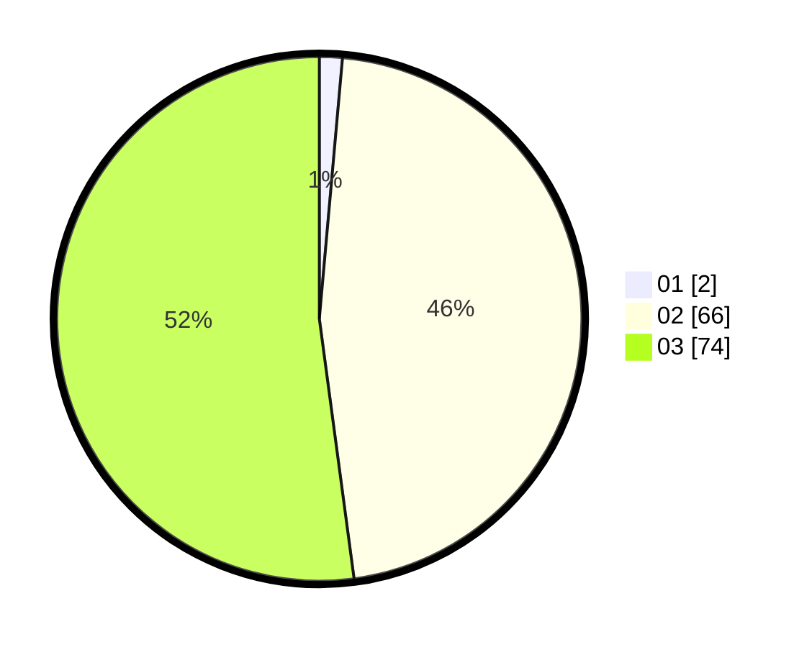

# Hasil

Hasil perolehan suara paslon dapat dilihat pada file paslon-01.txt, paslon-02.txt, dan paslon-03.txt.

Jika tidak ada, artinya data tersebut belum ada pada SIREKAP.

## Perolehan Suara

 * Paslon 01: **2**.
 * Paslon 02: **66**.
 * Paslon 03: **74**.

## Foto C Plano

https://sirekap-obj-formc.kpu.go.id/6817/pemilu/ppwp/31/72/02/10/06/3172021006225-20240214-191313--bbc998b7-300f-4967-a014-05aa482d1c40.jpg

https://sirekap-obj-formc.kpu.go.id/6817/pemilu/ppwp/31/72/02/10/06/3172021006225-20240214-192325--8a51abc1-d79b-488c-82bd-ecdf0ebfc354.jpg

https://sirekap-obj-formc.kpu.go.id/6817/pemilu/ppwp/31/72/02/10/06/3172021006225-20240214-191521--d5e60d45-42f9-4ccb-bce3-a9633a9cdc79.jpg

## DATA PEMILIH TETAP

Jumlah pemilih dalam DPT: **205**.
 * L: **105**.
 * P: **100**.

## DATA PENGGUNA HAK PILIH

Jumlah pengguna hak pilih dalam DPT: **139**.
 * L: **66**.
 * P: **73**.

Jumlah pengguna hak pilih dalam DPTb: **1**.
 * L: **0**.
 * P: **1**.

Jumlah pengguna hak pilih dalam DPK: **3**.
 * L: **2**.
 * P: **1**.

Jumlah pengguna hak pilih: **143**.
 * L: **68**.
 * P: **75**.

## JUMLAH SUARA SAH DAN TIDAK SAH

JUMLAH SELURUH SUARA SAH: **142**.

JUMLAH SUARA TIDAK SAH: **1**.

JUMLAH SELURUH SUARA SAH DAN SUARA TIDAK SAH: **143**.
