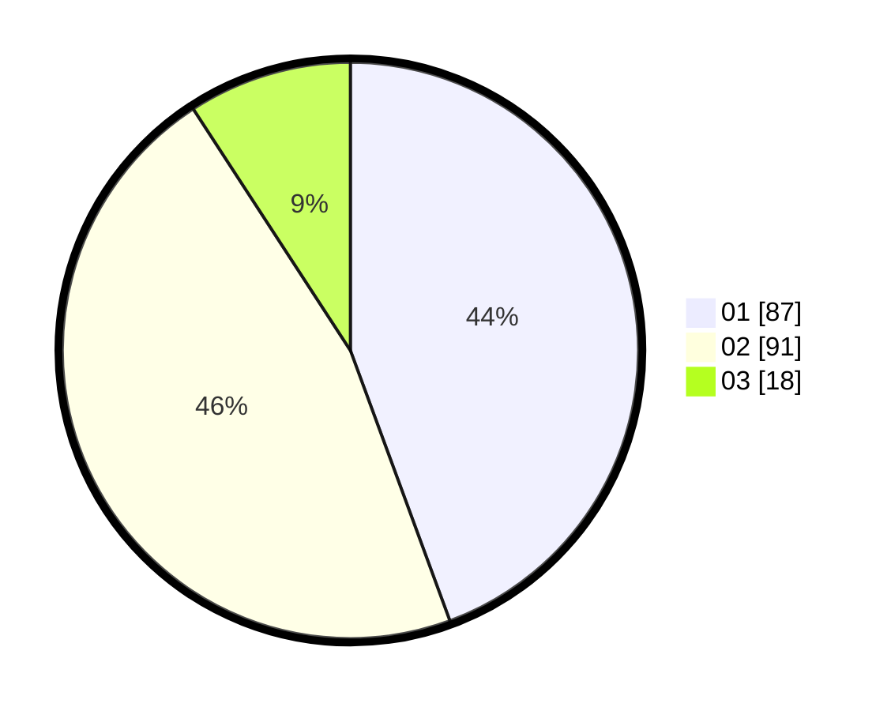

# Hasil

Hasil perolehan suara paslon dapat dilihat pada file paslon-01.txt, paslon-02.txt, dan paslon-03.txt.

Jika tidak ada, artinya data tersebut belum ada pada SIREKAP.

## Perolehan Suara

 * Paslon 01: **87**.
 * Paslon 02: **91**.
 * Paslon 03: **18**.

## Foto C Plano

https://sirekap-obj-formc.kpu.go.id/7e70/pemilu/ppwp/31/72/02/10/07/3172021007005-20240216-195742--6da2cecb-b94d-4c5a-a874-44a89509f0fe.jpg

https://sirekap-obj-formc.kpu.go.id/7e70/pemilu/ppwp/31/72/02/10/07/3172021007005-20240216-200020--bb9e5fff-b8d0-4e70-b59b-86f2fab3e497.jpg

https://sirekap-obj-formc.kpu.go.id/7e70/pemilu/ppwp/31/72/02/10/07/3172021007005-20240216-200110--d9280c0d-14ff-46b5-8981-6217c9a34f4a.jpg

## DATA PEMILIH TETAP

Jumlah pemilih dalam DPT: **287**.
 * L: **148**.
 * P: **139**.

## DATA PENGGUNA HAK PILIH

Jumlah pengguna hak pilih dalam DPT: **191**.
 * L: **91**.
 * P: **100**.

Jumlah pengguna hak pilih dalam DPTb: **0**.
 * L: **0**.
 * P: **0**.

Jumlah pengguna hak pilih dalam DPK: **6**.
 * L: **2**.
 * P: **4**.

Jumlah pengguna hak pilih: **197**.
 * L: **93**.
 * P: **104**.

## JUMLAH SUARA SAH DAN TIDAK SAH

JUMLAH SELURUH SUARA SAH: **196**.

JUMLAH SUARA TIDAK SAH: **1**.

JUMLAH SELURUH SUARA SAH DAN SUARA TIDAK SAH: **197**.
