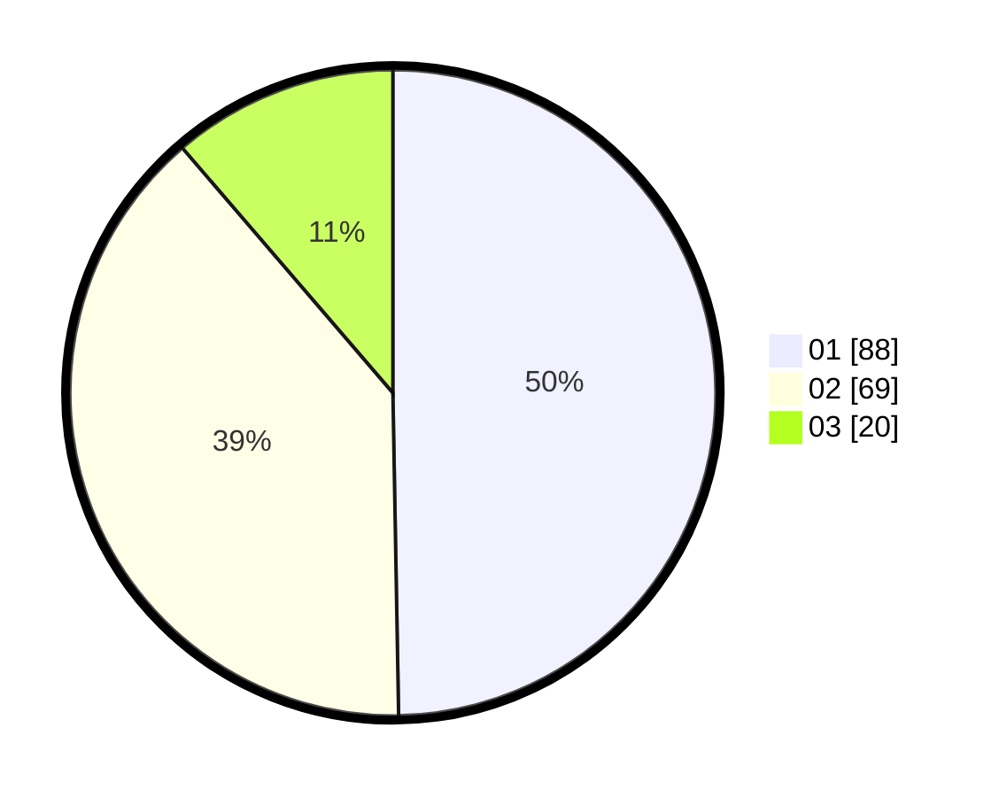

# Hasil

Hasil perolehan suara paslon dapat dilihat pada file paslon-01.txt, paslon-02.txt, dan paslon-03.txt.

Jika tidak ada, artinya data tersebut belum ada pada SIREKAP.

## Perolehan Suara

 * Paslon 01: **88**.
 * Paslon 02: **69**.
 * Paslon 03: **20**.

## Foto C Plano

https://sirekap-obj-formc.kpu.go.id/5506/pemilu/ppwp/31/72/02/10/07/3172021007008-20240216-150320--e96982d0-b4c6-41f2-bf30-54ddfc0755f0.jpg

https://sirekap-obj-formc.kpu.go.id/5506/pemilu/ppwp/31/72/02/10/07/3172021007008-20240216-150210--6641b58e-ea93-4f03-b772-d70b874fc431.jpg

https://sirekap-obj-formc.kpu.go.id/5506/pemilu/ppwp/31/72/02/10/07/3172021007008-20240216-150048--7069905a-6e2e-4b09-8b55-57eee36ea59e.jpg

## DATA PEMILIH TETAP

Jumlah pemilih dalam DPT: **285**.
 * L: **145**.
 * P: **140**.

## DATA PENGGUNA HAK PILIH

Jumlah pengguna hak pilih dalam DPT: **176**.
 * L: **86**.
 * P: **90**.

Jumlah pengguna hak pilih dalam DPTb: **0**.
 * L: **0**.
 * P: **0**.

Jumlah pengguna hak pilih dalam DPK: **1**.
 * L: **0**.
 * P: **1**.

Jumlah pengguna hak pilih: **177**.
 * L: **86**.
 * P: **91**.

## JUMLAH SUARA SAH DAN TIDAK SAH

JUMLAH SELURUH SUARA SAH: **177**.

JUMLAH SUARA TIDAK SAH: **0**.

JUMLAH SELURUH SUARA SAH DAN SUARA TIDAK SAH: **177**.
