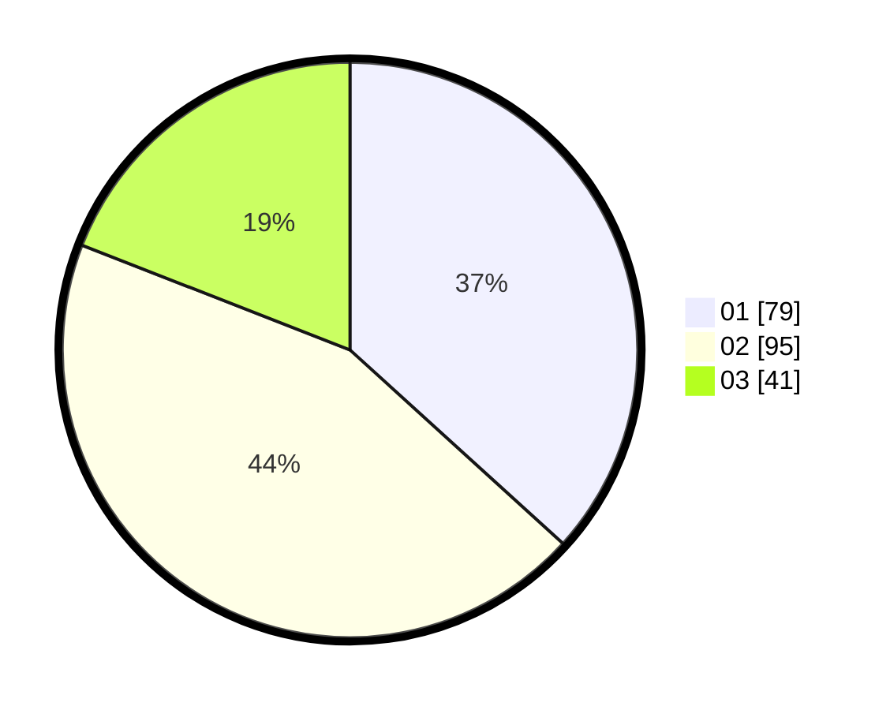

# Hasil

Hasil perolehan suara paslon dapat dilihat pada file paslon-01.txt, paslon-02.txt, dan paslon-03.txt.

Jika tidak ada, artinya data tersebut belum ada pada SIREKAP.

## Perolehan Suara

 * Paslon 01: **79**.
 * Paslon 02: **95**.
 * Paslon 03: **41**.

## Foto C Plano

https://sirekap-obj-formc.kpu.go.id/e5a2/pemilu/ppwp/31/72/02/10/07/3172021007011-20240214-203921--06874b95-8556-436b-8e8e-ad5ff1c320a7.jpg

https://sirekap-obj-formc.kpu.go.id/e5a2/pemilu/ppwp/31/72/02/10/07/3172021007011-20240214-204027--74ec878d-0e83-4919-9b7b-a7d2c39437a9.jpg

https://sirekap-obj-formc.kpu.go.id/e5a2/pemilu/ppwp/31/72/02/10/07/3172021007011-20240214-203937--768f9bd2-dc43-4e3a-9fcb-229f558b0c11.jpg
