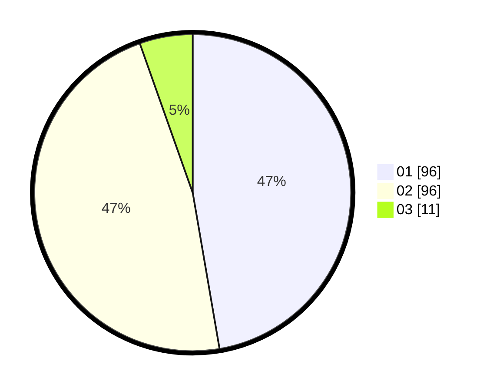

# Hasil

Hasil perolehan suara paslon dapat dilihat pada file paslon-01.txt, paslon-02.txt, dan paslon-03.txt.

Jika tidak ada, artinya data tersebut belum ada pada SIREKAP.

## Perolehan Suara

 * Paslon 01: **96**.
 * Paslon 02: **96**.
 * Paslon 03: **11**.

## Foto C Plano

https://sirekap-obj-formc.kpu.go.id/5f9f/pemilu/ppwp/31/72/02/10/07/3172021007019-20240214-214451--623f6acc-46d8-4fe2-8a5a-5dacc4b3922b.jpg

https://sirekap-obj-formc.kpu.go.id/5f9f/pemilu/ppwp/31/72/02/10/07/3172021007019-20240214-214542--f430e26d-0b62-4653-86da-514ea863aee7.jpg

https://sirekap-obj-formc.kpu.go.id/5f9f/pemilu/ppwp/31/72/02/10/07/3172021007019-20240214-214618--6b6f632b-6720-4844-a3a9-7f6f332c5f26.jpg

## DATA PEMILIH TETAP

Jumlah pemilih dalam DPT: **243**.
 * L: **135**.
 * P: **148**.

## DATA PENGGUNA HAK PILIH

Jumlah pengguna hak pilih dalam DPT: **194**.
 * L: **86**.
 * P: **108**.

Jumlah pengguna hak pilih dalam DPTb: **4**.
 * L: **1**.
 * P: **3**.

Jumlah pengguna hak pilih dalam DPK: **8**.
 * L: **5**.
 * P: **3**.

Jumlah pengguna hak pilih: **206**.
 * L: **92**.
 * P: **114**.

## JUMLAH SUARA SAH DAN TIDAK SAH

JUMLAH SELURUH SUARA SAH: **203**.

JUMLAH SUARA TIDAK SAH: **3**.

JUMLAH SELURUH SUARA SAH DAN SUARA TIDAK SAH: **206**.
