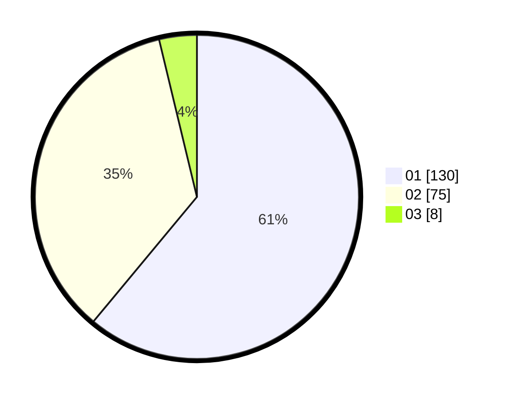

# Hasil

Hasil perolehan suara paslon dapat dilihat pada file paslon-01.txt, paslon-02.txt, dan paslon-03.txt.

Jika tidak ada, artinya data tersebut belum ada pada SIREKAP.

## Perolehan Suara

 * Paslon 01: **130**.
 * Paslon 02: **75**.
 * Paslon 03: **8**.

## Foto C Plano

https://sirekap-obj-formc.kpu.go.id/639e/pemilu/ppwp/31/72/02/10/07/3172021007020-20240214-193520--6cb43b79-7344-457e-8ad8-2a5462ce3c6a.jpg

https://sirekap-obj-formc.kpu.go.id/639e/pemilu/ppwp/31/72/02/10/07/3172021007020-20240214-193538--4620b398-490d-4343-8951-f4493fcd864b.jpg

https://sirekap-obj-formc.kpu.go.id/639e/pemilu/ppwp/31/72/02/10/07/3172021007020-20240214-193613--86adfde2-db31-4345-aeb9-38de6f3e2390.jpg

## DATA PEMILIH TETAP

Jumlah pemilih dalam DPT: **291**.
 * L: **144**.
 * P: **147**.

## DATA PENGGUNA HAK PILIH

Jumlah pengguna hak pilih dalam DPT: **212**.
 * L: **103**.
 * P: **109**.

Jumlah pengguna hak pilih dalam DPTb: **2**.
 * L: **1**.
 * P: **1**.

Jumlah pengguna hak pilih dalam DPK: **3**.
 * L: **3**.
 * P: **0**.

Jumlah pengguna hak pilih: **217**.
 * L: **107**.
 * P: **110**.

## JUMLAH SUARA SAH DAN TIDAK SAH

JUMLAH SELURUH SUARA SAH: **213**.

JUMLAH SUARA TIDAK SAH: **4**.

JUMLAH SELURUH SUARA SAH DAN SUARA TIDAK SAH: **217**.
