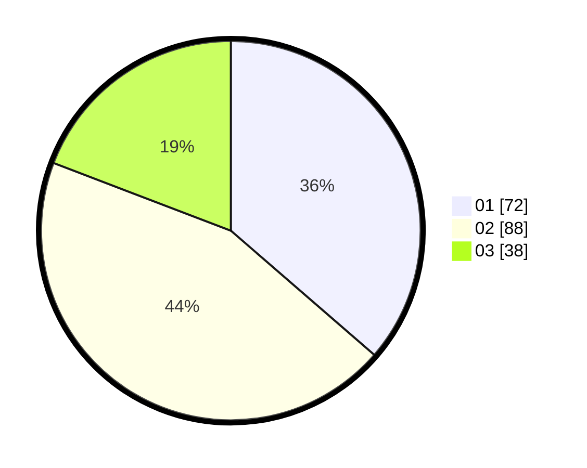

# Hasil

Hasil perolehan suara paslon dapat dilihat pada file paslon-01.txt, paslon-02.txt, dan paslon-03.txt.

Jika tidak ada, artinya data tersebut belum ada pada SIREKAP.

## Perolehan Suara

 * Paslon 01: **72**.
 * Paslon 02: **88**.
 * Paslon 03: **38**.

## Foto C Plano

https://sirekap-obj-formc.kpu.go.id/b157/pemilu/ppwp/31/72/02/10/07/3172021007037-20240214-155303--dd1fc3c2-a3d8-425f-b321-30577ab4e75b.jpg

https://sirekap-obj-formc.kpu.go.id/b157/pemilu/ppwp/31/72/02/10/07/3172021007037-20240214-155452--968dd4fc-d754-48aa-88df-9184a26692f4.jpg

https://sirekap-obj-formc.kpu.go.id/b157/pemilu/ppwp/31/72/02/10/07/3172021007037-20240214-155606--5414b766-d47c-4c3e-8604-ac166389cfac.jpg

## DATA PEMILIH TETAP

Jumlah pemilih dalam DPT: **289**.
 * L: **151**.
 * P: **138**.

## DATA PENGGUNA HAK PILIH

Jumlah pengguna hak pilih dalam DPT: **196**.
 * L: **96**.
 * P: **100**.

Jumlah pengguna hak pilih dalam DPTb: **2**.
 * L: **1**.
 * P: **1**.

Jumlah pengguna hak pilih dalam DPK: **2**.
 * L: **1**.
 * P: **1**.

Jumlah pengguna hak pilih: **200**.
 * L: **98**.
 * P: **102**.

## JUMLAH SUARA SAH DAN TIDAK SAH

JUMLAH SELURUH SUARA SAH: **198**.

JUMLAH SUARA TIDAK SAH: **2**.

JUMLAH SELURUH SUARA SAH DAN SUARA TIDAK SAH: **200**.
