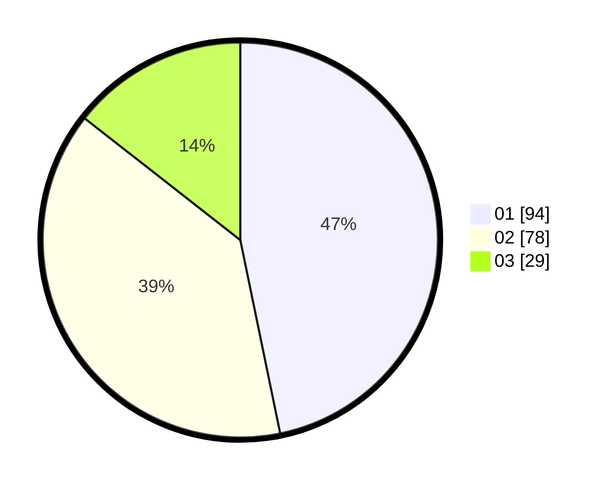

# Hasil

Hasil perolehan suara paslon dapat dilihat pada file paslon-01.txt, paslon-02.txt, dan paslon-03.txt.

Jika tidak ada, artinya data tersebut belum ada pada SIREKAP.

## Perolehan Suara

 * Paslon 01: **94**.
 * Paslon 02: **78**.
 * Paslon 03: **29**.

## Foto C Plano

https://sirekap-obj-formc.kpu.go.id/1709/pemilu/ppwp/31/72/02/10/07/3172021007039-20240214-155203--c0f145c9-28bc-48cb-b3d9-10b218cb6e83.jpg

https://sirekap-obj-formc.kpu.go.id/1709/pemilu/ppwp/31/72/02/10/07/3172021007039-20240214-155230--386bc2ff-3eb3-4388-93f7-5957cd8f322d.jpg

https://sirekap-obj-formc.kpu.go.id/1709/pemilu/ppwp/31/72/02/10/07/3172021007039-20240214-155147--df6c1d6e-1e89-4758-a106-6014ddb54777.jpg

## DATA PEMILIH TETAP

Jumlah pemilih dalam DPT: **284**.
 * L: **141**.
 * P: **143**.

## DATA PENGGUNA HAK PILIH

Jumlah pengguna hak pilih dalam DPT: **201**.
 * L: **99**.
 * P: **102**.

Jumlah pengguna hak pilih dalam DPTb: **0**.
 * L: **0**.
 * P: **0**.

Jumlah pengguna hak pilih dalam DPK: **4**.
 * L: **3**.
 * P: **1**.

Jumlah pengguna hak pilih: **205**.
 * L: **102**.
 * P: **103**.

## JUMLAH SUARA SAH DAN TIDAK SAH

JUMLAH SELURUH SUARA SAH: **201**.

JUMLAH SUARA TIDAK SAH: **4**.

JUMLAH SELURUH SUARA SAH DAN SUARA TIDAK SAH: **205**.
