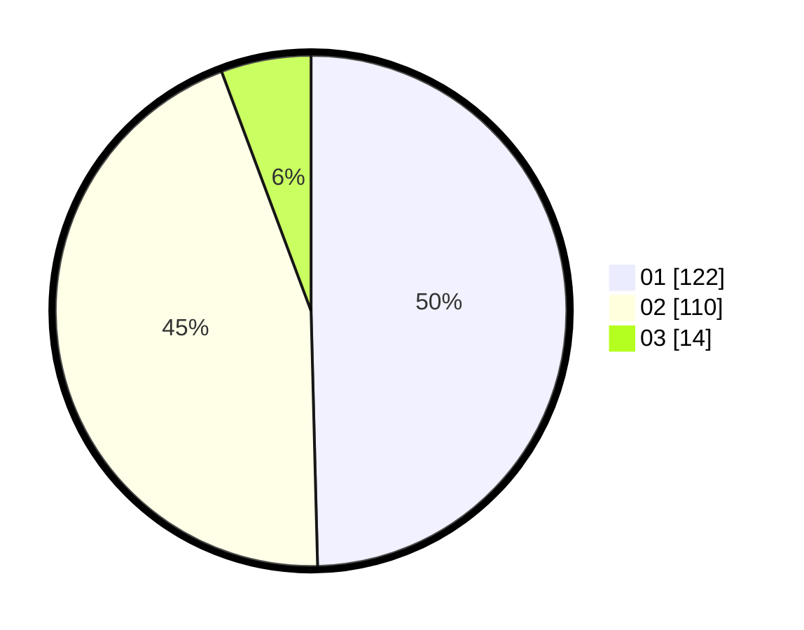

# Hasil

Hasil perolehan suara paslon dapat dilihat pada file paslon-01.txt, paslon-02.txt, dan paslon-03.txt.

Jika tidak ada, artinya data tersebut belum ada pada SIREKAP.

## Perolehan Suara

 * Paslon 01: **122**.
 * Paslon 02: **110**.
 * Paslon 03: **14**.

## Foto C Plano

https://sirekap-obj-formc.kpu.go.id/dfa8/pemilu/ppwp/31/72/02/10/07/3172021007061-20240214-193328--ae007792-f7f4-4730-b0e0-aae6fa22d275.jpg

https://sirekap-obj-formc.kpu.go.id/dfa8/pemilu/ppwp/31/72/02/10/07/3172021007061-20240214-193613--e39f0f73-548a-4100-a7d0-4c224334d021.jpg

https://sirekap-obj-formc.kpu.go.id/dfa8/pemilu/ppwp/31/72/02/10/07/3172021007061-20240214-194020--c0bca6af-09d2-4bd1-87da-be255a411299.jpg

## DATA PEMILIH TETAP

Jumlah pemilih dalam DPT: **292**.
 * L: **144**.
 * P: **148**.

## DATA PENGGUNA HAK PILIH

Jumlah pengguna hak pilih dalam DPT: **241**.
 * L: **116**.
 * P: **125**.

Jumlah pengguna hak pilih dalam DPTb: **6**.
 * L: **3**.
 * P: **3**.

Jumlah pengguna hak pilih dalam DPK: **0**.
 * L: **0**.
 * P: **0**.

Jumlah pengguna hak pilih: **247**.
 * L: **119**.
 * P: **128**.

## JUMLAH SUARA SAH DAN TIDAK SAH

JUMLAH SELURUH SUARA SAH: **246**.

JUMLAH SUARA TIDAK SAH: **1**.

JUMLAH SELURUH SUARA SAH DAN SUARA TIDAK SAH: **247**.
