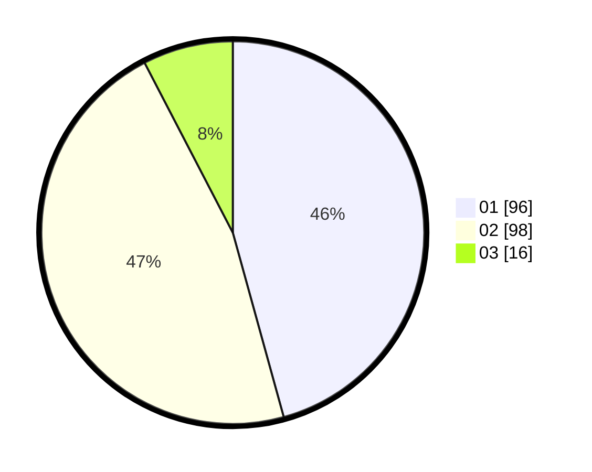

# Hasil

Hasil perolehan suara paslon dapat dilihat pada file paslon-01.txt, paslon-02.txt, dan paslon-03.txt.

Jika tidak ada, artinya data tersebut belum ada pada SIREKAP.

## Perolehan Suara

 * Paslon 01: **96**.
 * Paslon 02: **98**.
 * Paslon 03: **16**.

## Foto C Plano

https://sirekap-obj-formc.kpu.go.id/02cd/pemilu/ppwp/31/72/03/10/01/3172031001002-20240214-194842--955a5cf6-92b2-4d55-964a-1ca6e2770da6.jpg

https://sirekap-obj-formc.kpu.go.id/02cd/pemilu/ppwp/31/72/03/10/01/3172031001002-20240215-003658--e0fd23e3-fbb2-43cf-bb29-64c8d79c395e.jpg

https://sirekap-obj-formc.kpu.go.id/02cd/pemilu/ppwp/31/72/03/10/01/3172031001002-20240214-195203--4b8b9b3c-c554-41db-b7ff-a2167f542bc7.jpg

## DATA PEMILIH TETAP

Jumlah pemilih dalam DPT: **293**.
 * L: **136**.
 * P: **157**.

## DATA PENGGUNA HAK PILIH

Jumlah pengguna hak pilih dalam DPT: **207**.
 * L: **89**.
 * P: **118**.

Jumlah pengguna hak pilih dalam DPTb: **5**.
 * L: **3**.
 * P: **2**.

Jumlah pengguna hak pilih dalam DPK: **0**.
 * L: **0**.
 * P: **0**.

Jumlah pengguna hak pilih: **212**.
 * L: **92**.
 * P: **120**.

## JUMLAH SUARA SAH DAN TIDAK SAH

JUMLAH SELURUH SUARA SAH: **210**.

JUMLAH SUARA TIDAK SAH: **2**.

JUMLAH SELURUH SUARA SAH DAN SUARA TIDAK SAH: **212**.
