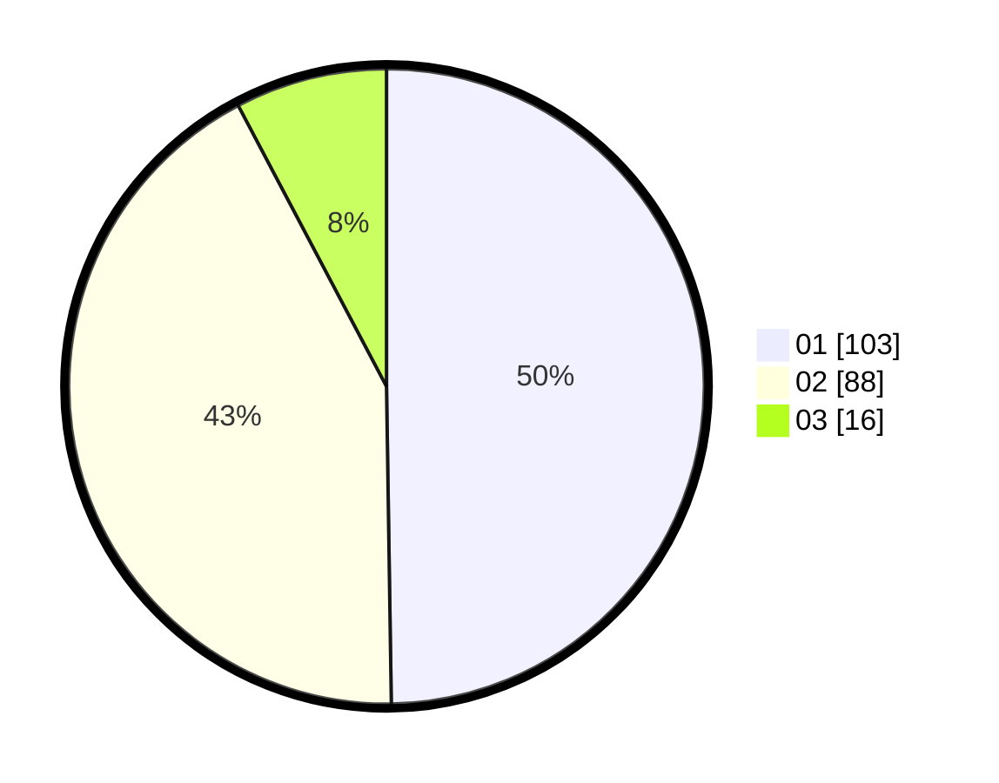

# Hasil

Hasil perolehan suara paslon dapat dilihat pada file paslon-01.txt, paslon-02.txt, dan paslon-03.txt.

Jika tidak ada, artinya data tersebut belum ada pada SIREKAP.

## Perolehan Suara

 * Paslon 01: **103**.
 * Paslon 02: **88**.
 * Paslon 03: **16**.

## Foto C Plano

https://sirekap-obj-formc.kpu.go.id/2416/pemilu/ppwp/31/72/03/10/01/3172031001010-20240214-155112--955607fa-b306-4e98-a051-72eee29324b3.jpg

https://sirekap-obj-formc.kpu.go.id/2416/pemilu/ppwp/31/72/03/10/01/3172031001010-20240214-155116--4d8dbbef-b3fd-41ab-994b-5a05ba1185d6.jpg

https://sirekap-obj-formc.kpu.go.id/2416/pemilu/ppwp/31/72/03/10/01/3172031001010-20240214-155121--8995cce3-12d7-4085-972b-ccb69505cfe2.jpg

## DATA PEMILIH TETAP

Jumlah pemilih dalam DPT: **278**.
 * L: **152**.
 * P: **126**.

## DATA PENGGUNA HAK PILIH

Jumlah pengguna hak pilih dalam DPT: **206**.
 * L: **102**.
 * P: **104**.

Jumlah pengguna hak pilih dalam DPTb: **1**.
 * L: **0**.
 * P: **1**.

Jumlah pengguna hak pilih dalam DPK: **3**.
 * L: **2**.
 * P: **1**.

Jumlah pengguna hak pilih: **210**.
 * L: **0**.
 * P: **0**.

## JUMLAH SUARA SAH DAN TIDAK SAH

JUMLAH SELURUH SUARA SAH: **207**.

JUMLAH SUARA TIDAK SAH: **3**.

JUMLAH SELURUH SUARA SAH DAN SUARA TIDAK SAH: **210**.
