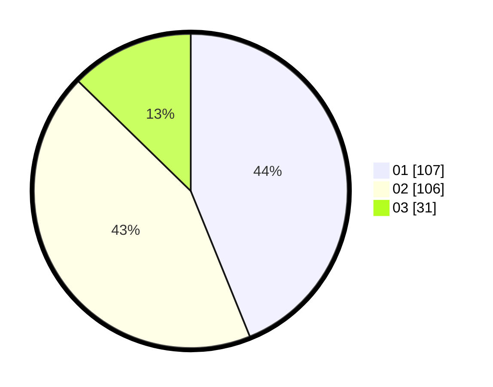

# Hasil

Hasil perolehan suara paslon dapat dilihat pada file paslon-01.txt, paslon-02.txt, dan paslon-03.txt.

Jika tidak ada, artinya data tersebut belum ada pada SIREKAP.

## Perolehan Suara

 * Paslon 01: **107**.
 * Paslon 02: **106**.
 * Paslon 03: **31**.

## Foto C Plano

https://sirekap-obj-formc.kpu.go.id/58bb/pemilu/ppwp/31/72/03/10/01/3172031001017-20240214-190549--3bd42b3e-eb16-4bbe-95b1-0825df9dbf78.jpg

https://sirekap-obj-formc.kpu.go.id/58bb/pemilu/ppwp/31/72/03/10/01/3172031001017-20240214-190649--8af3e55d-322f-4ea3-b71e-dbcd90c5e140.jpg

https://sirekap-obj-formc.kpu.go.id/58bb/pemilu/ppwp/31/72/03/10/01/3172031001017-20240214-193421--f3b91d57-a5dc-499c-91f9-a06e7851e336.jpg

## DATA PEMILIH TETAP

Jumlah pemilih dalam DPT: **288**.
 * L: **148**.
 * P: **140**.

## DATA PENGGUNA HAK PILIH

Jumlah pengguna hak pilih dalam DPT: **231**.
 * L: **117**.
 * P: **114**.

Jumlah pengguna hak pilih dalam DPTb: **16**.
 * L: **5**.
 * P: **11**.

Jumlah pengguna hak pilih dalam DPK: **0**.
 * L: **0**.
 * P: **0**.

Jumlah pengguna hak pilih: **247**.
 * L: **122**.
 * P: **127**.

## JUMLAH SUARA SAH DAN TIDAK SAH

JUMLAH SELURUH SUARA SAH: **244**.

JUMLAH SUARA TIDAK SAH: **3**.

JUMLAH SELURUH SUARA SAH DAN SUARA TIDAK SAH: **247**.
