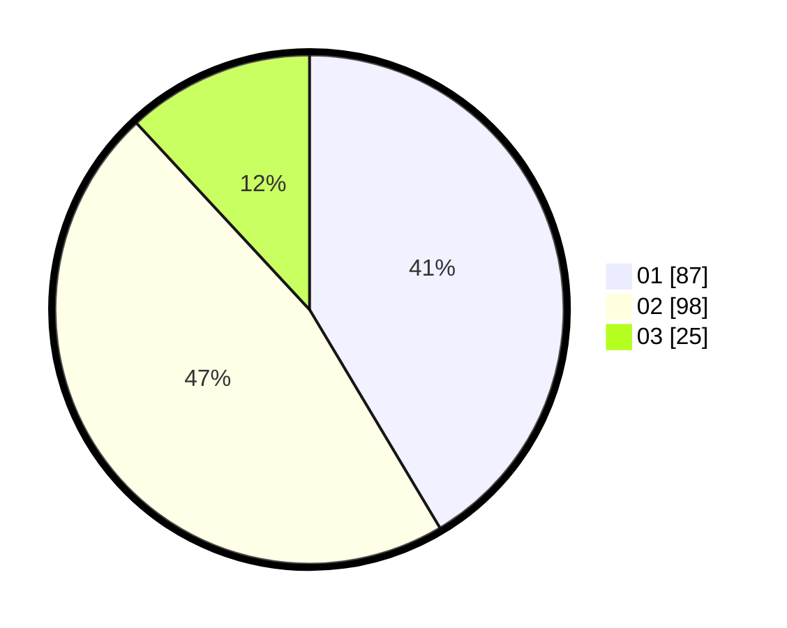

# Hasil

Hasil perolehan suara paslon dapat dilihat pada file paslon-01.txt, paslon-02.txt, dan paslon-03.txt.

Jika tidak ada, artinya data tersebut belum ada pada SIREKAP.

## Perolehan Suara

 * Paslon 01: **87**.
 * Paslon 02: **98**.
 * Paslon 03: **25**.

## Foto C Plano

https://sirekap-obj-formc.kpu.go.id/0ef3/pemilu/ppwp/31/72/03/10/01/3172031001019-20240217-063728--70fc59cd-11b4-4219-b13d-49c977e5476c.jpg

https://sirekap-obj-formc.kpu.go.id/0ef3/pemilu/ppwp/31/72/03/10/01/3172031001019-20240214-231416--37f38c26-4236-4b47-96db-e7924f17ba75.jpg

https://sirekap-obj-formc.kpu.go.id/0ef3/pemilu/ppwp/31/72/03/10/01/3172031001019-20240214-231421--71450eda-9b6d-48b3-926d-ec54d1898d61.jpg
