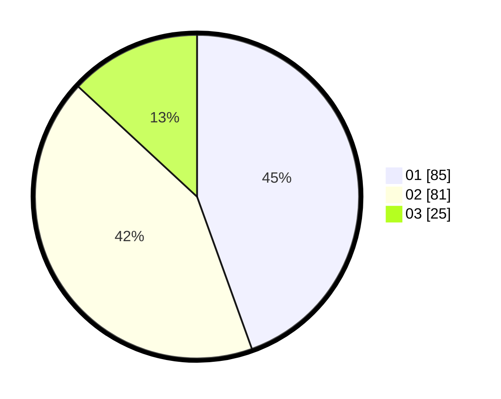

# Hasil

Hasil perolehan suara paslon dapat dilihat pada file paslon-01.txt, paslon-02.txt, dan paslon-03.txt.

Jika tidak ada, artinya data tersebut belum ada pada SIREKAP.

## Perolehan Suara

 * Paslon 01: **85**.
 * Paslon 02: **81**.
 * Paslon 03: **25**.

## Foto C Plano

https://sirekap-obj-formc.kpu.go.id/95a3/pemilu/ppwp/31/72/03/10/01/3172031001022-20240214-202043--a5ae04b3-e0be-49e4-a25f-bc4e4af40b27.jpg

https://sirekap-obj-formc.kpu.go.id/95a3/pemilu/ppwp/31/72/03/10/01/3172031001022-20240214-202059--f41ee0e1-1954-4bee-bbce-c635729bf77c.jpg

https://sirekap-obj-formc.kpu.go.id/95a3/pemilu/ppwp/31/72/03/10/01/3172031001022-20240214-202113--3f3374dd-f7bb-4fd3-bdc6-d8e84e90433a.jpg

## DATA PEMILIH TETAP

Jumlah pemilih dalam DPT: **194**.
 * L: **100**.
 * P: **94**.

## DATA PENGGUNA HAK PILIH

Jumlah pengguna hak pilih dalam DPT: **192**.
 * L: **99**.
 * P: **93**.

Jumlah pengguna hak pilih dalam DPTb: **2**.
 * L: **1**.
 * P: **1**.

Jumlah pengguna hak pilih dalam DPK: **0**.
 * L: **0**.
 * P: **0**.

Jumlah pengguna hak pilih: **194**.
 * L: **100**.
 * P: **94**.

## JUMLAH SUARA SAH DAN TIDAK SAH

JUMLAH SELURUH SUARA SAH: **191**.

JUMLAH SUARA TIDAK SAH: **3**.

JUMLAH SELURUH SUARA SAH DAN SUARA TIDAK SAH: **194**.
