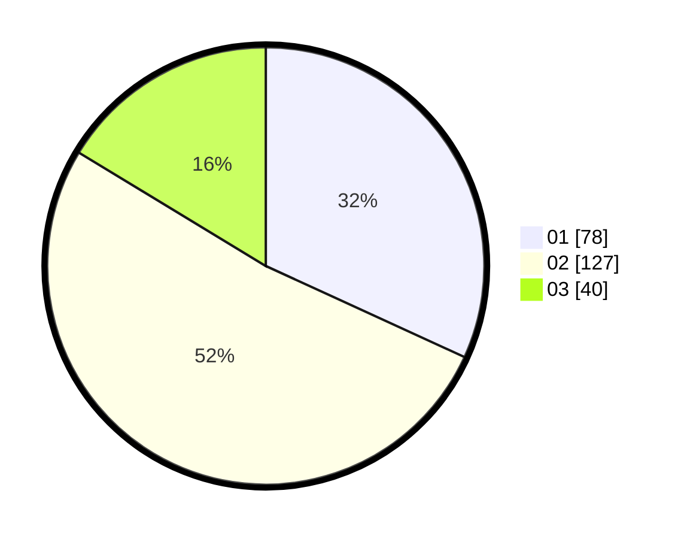

# Hasil

Hasil perolehan suara paslon dapat dilihat pada file paslon-01.txt, paslon-02.txt, dan paslon-03.txt.

Jika tidak ada, artinya data tersebut belum ada pada SIREKAP.

## Perolehan Suara

 * Paslon 01: **78**.
 * Paslon 02: **127**.
 * Paslon 03: **40**.

## Foto C Plano

https://sirekap-obj-formc.kpu.go.id/a310/pemilu/ppwp/31/72/03/10/01/3172031001041-20240214-155159--de3c5815-09cb-426b-834b-a377e4cf1bcd.jpg

https://sirekap-obj-formc.kpu.go.id/a310/pemilu/ppwp/31/72/03/10/01/3172031001041-20240214-155446--1bc8bfae-d011-4951-bcc3-677174feb393.jpg
