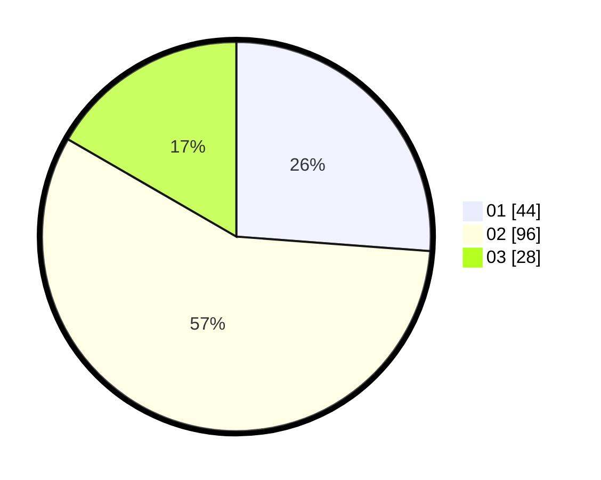

# Hasil

Hasil perolehan suara paslon dapat dilihat pada file paslon-01.txt, paslon-02.txt, dan paslon-03.txt.

Jika tidak ada, artinya data tersebut belum ada pada SIREKAP.

## Perolehan Suara

 * Paslon 01: **44**.
 * Paslon 02: **96**.
 * Paslon 03: **28**.

## Foto C Plano

https://sirekap-obj-formc.kpu.go.id/ec2d/pemilu/ppwp/31/72/03/10/01/3172031001045-20240214-220831--03b5c29f-6901-4cc0-9956-55ffba587a10.jpg

https://sirekap-obj-formc.kpu.go.id/ec2d/pemilu/ppwp/31/72/03/10/01/3172031001045-20240214-220656--f58b76f1-3f75-4bef-9fc9-cba900cd0238.jpg

https://sirekap-obj-formc.kpu.go.id/ec2d/pemilu/ppwp/31/72/03/10/01/3172031001045-20240214-220322--18ffcc47-fc63-4619-833c-50e18b0ab0ed.jpg
