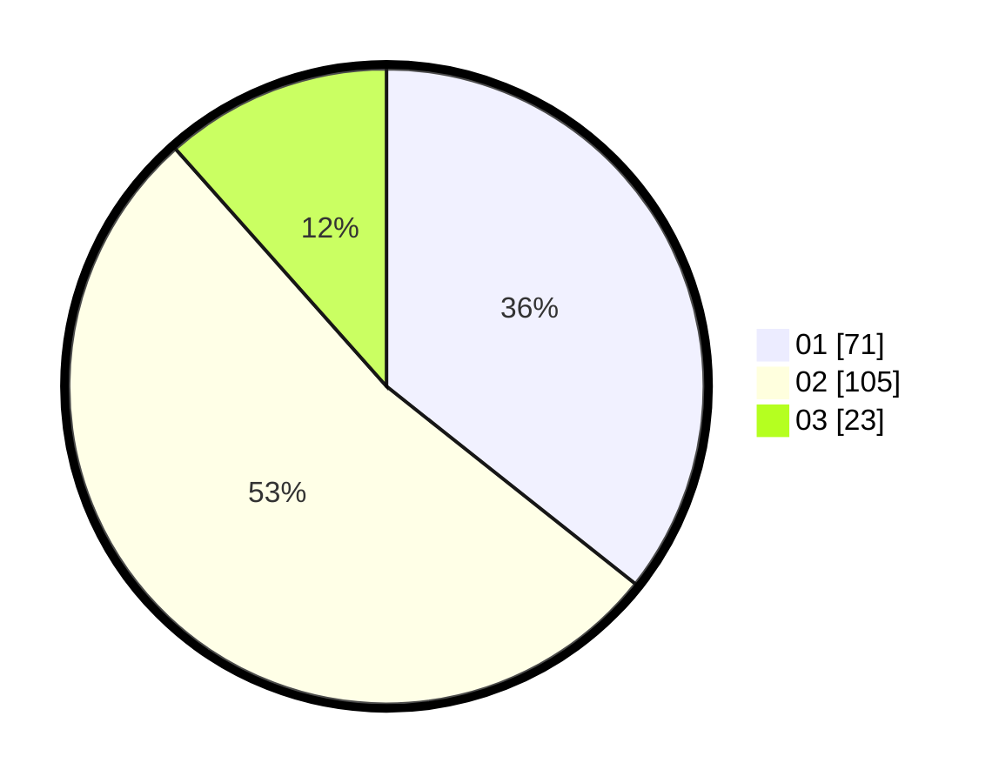

# Hasil

Hasil perolehan suara paslon dapat dilihat pada file paslon-01.txt, paslon-02.txt, dan paslon-03.txt.

Jika tidak ada, artinya data tersebut belum ada pada SIREKAP.

## Perolehan Suara

 * Paslon 01: **71**.
 * Paslon 02: **105**.
 * Paslon 03: **23**.

## Foto C Plano

https://sirekap-obj-formc.kpu.go.id/824f/pemilu/ppwp/31/72/03/10/01/3172031001055-20240214-160141--083290d0-e857-4b9c-bb3e-058f10e4fbc4.jpg

https://sirekap-obj-formc.kpu.go.id/824f/pemilu/ppwp/31/72/03/10/01/3172031001055-20240214-155635--cee99c63-d6da-44a8-b47e-f07a45d99f3b.jpg

https://sirekap-obj-formc.kpu.go.id/824f/pemilu/ppwp/31/72/03/10/01/3172031001055-20240214-155814--dc4af844-760b-4ff0-8399-be34e106f2fa.jpg
