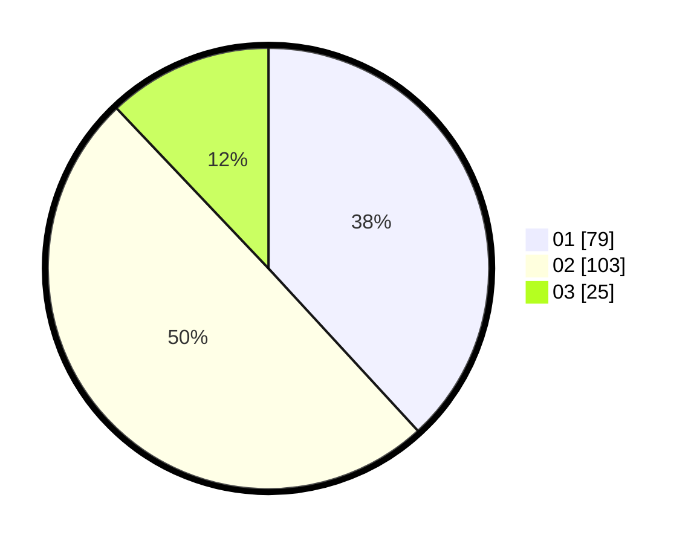

# Hasil

Hasil perolehan suara paslon dapat dilihat pada file paslon-01.txt, paslon-02.txt, dan paslon-03.txt.

Jika tidak ada, artinya data tersebut belum ada pada SIREKAP.

## Perolehan Suara

 * Paslon 01: **79**.
 * Paslon 02: **103**.
 * Paslon 03: **25**.

## Foto C Plano

https://sirekap-obj-formc.kpu.go.id/f120/pemilu/ppwp/31/72/03/10/01/3172031001056-20240214-191531--f6aacd04-890d-4d07-8a3b-e2c2937e420b.jpg

https://sirekap-obj-formc.kpu.go.id/f120/pemilu/ppwp/31/72/03/10/01/3172031001056-20240214-191526--3e06b5ca-a4cd-4282-87dc-b661aed8d4d0.jpg

https://sirekap-obj-formc.kpu.go.id/f120/pemilu/ppwp/31/72/03/10/01/3172031001056-20240215-214512--5de33753-f61c-4c7a-ba5d-ce174d9074e7.jpg

## DATA PEMILIH TETAP

Jumlah pemilih dalam DPT: **289**.
 * L: **146**.
 * P: **143**.

## DATA PENGGUNA HAK PILIH

Jumlah pengguna hak pilih dalam DPT: **206**.
 * L: **93**.
 * P: **113**.

Jumlah pengguna hak pilih dalam DPTb: **2**.
 * L: **1**.
 * P: **1**.

Jumlah pengguna hak pilih dalam DPK: **2**.
 * L: **1**.
 * P: **1**.

Jumlah pengguna hak pilih: **210**.
 * L: **95**.
 * P: **115**.

## JUMLAH SUARA SAH DAN TIDAK SAH

JUMLAH SELURUH SUARA SAH: **207**.

JUMLAH SUARA TIDAK SAH: **3**.

JUMLAH SELURUH SUARA SAH DAN SUARA TIDAK SAH: **210**.
