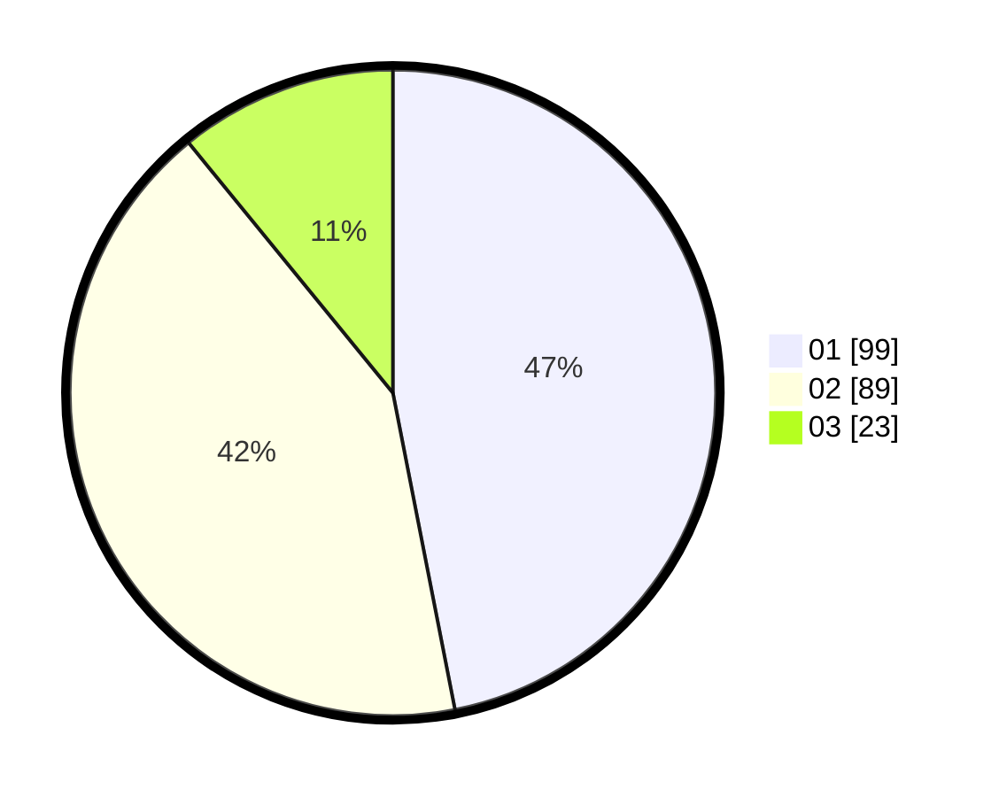

# Hasil

Hasil perolehan suara paslon dapat dilihat pada file paslon-01.txt, paslon-02.txt, dan paslon-03.txt.

Jika tidak ada, artinya data tersebut belum ada pada SIREKAP.

## Perolehan Suara

 * Paslon 01: **99**.
 * Paslon 02: **89**.
 * Paslon 03: **23**.

## Foto C Plano

https://sirekap-obj-formc.kpu.go.id/fde2/pemilu/ppwp/31/72/03/10/01/3172031001070-20240214-155642--8fb3d3e4-61ed-4c8d-bc43-9d8d7f6eae04.jpg

https://sirekap-obj-formc.kpu.go.id/fde2/pemilu/ppwp/31/72/03/10/01/3172031001070-20240214-160059--6e99d3e1-8a14-40b7-94d2-d7d11d604d7e.jpg

https://sirekap-obj-formc.kpu.go.id/fde2/pemilu/ppwp/31/72/03/10/01/3172031001070-20240214-160057--ffc8dc72-e797-48c0-bf35-9b50d5e79fba.jpg

## DATA PEMILIH TETAP

Jumlah pemilih dalam DPT: **291**.
 * L: **146**.
 * P: **145**.

## DATA PENGGUNA HAK PILIH

Jumlah pengguna hak pilih dalam DPT: **211**.
 * L: **97**.
 * P: **114**.

Jumlah pengguna hak pilih dalam DPTb: **0**.
 * L: **0**.
 * P: **0**.

Jumlah pengguna hak pilih dalam DPK: **3**.
 * L: **2**.
 * P: **1**.

Jumlah pengguna hak pilih: **214**.
 * L: **99**.
 * P: **115**.

## JUMLAH SUARA SAH DAN TIDAK SAH

JUMLAH SELURUH SUARA SAH: **211**.

JUMLAH SUARA TIDAK SAH: **3**.

JUMLAH SELURUH SUARA SAH DAN SUARA TIDAK SAH: **214**.
