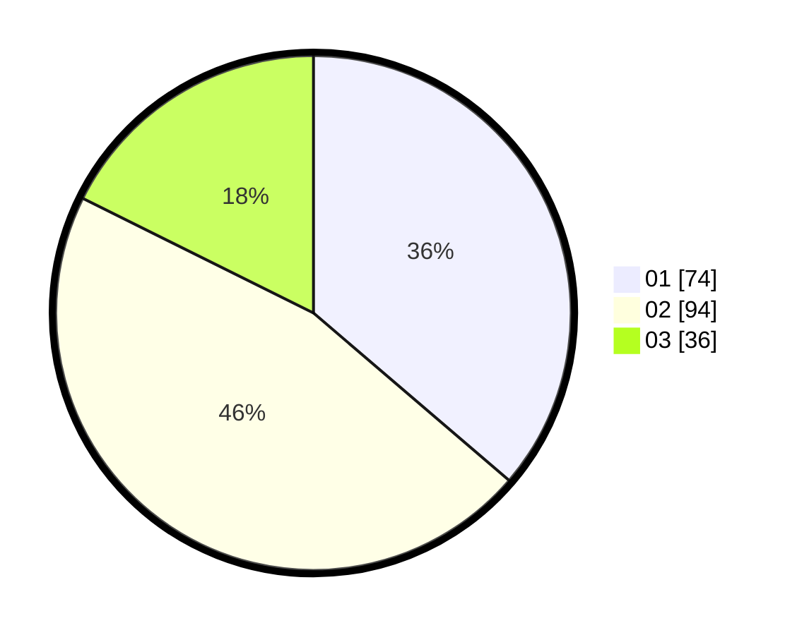

# Hasil

Hasil perolehan suara paslon dapat dilihat pada file paslon-01.txt, paslon-02.txt, dan paslon-03.txt.

Jika tidak ada, artinya data tersebut belum ada pada SIREKAP.

## Perolehan Suara

 * Paslon 01: **74**.
 * Paslon 02: **94**.
 * Paslon 03: **36**.

## Foto C Plano

https://sirekap-obj-formc.kpu.go.id/8fe2/pemilu/ppwp/31/72/03/10/01/3172031001072-20240214-234842--ccc53d35-05a9-4070-8640-8338fbca482d.jpg

https://sirekap-obj-formc.kpu.go.id/8fe2/pemilu/ppwp/31/72/03/10/01/3172031001072-20240214-200139--be29daef-1a3f-4539-a5e7-31087ca5bb0a.jpg

https://sirekap-obj-formc.kpu.go.id/8fe2/pemilu/ppwp/31/72/03/10/01/3172031001072-20240215-021616--baa6b0cb-d242-4a05-92d1-0d685a41d76a.jpg
