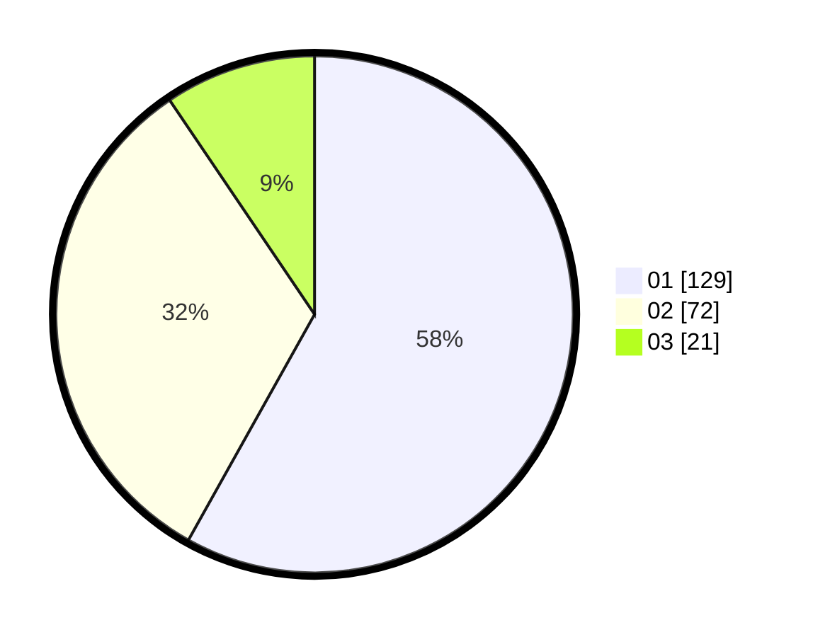

# Hasil

Hasil perolehan suara paslon dapat dilihat pada file paslon-01.txt, paslon-02.txt, dan paslon-03.txt.

Jika tidak ada, artinya data tersebut belum ada pada SIREKAP.

## Perolehan Suara

 * Paslon 01: **129**.
 * Paslon 02: **72**.
 * Paslon 03: **21**.

## Foto C Plano

https://sirekap-obj-formc.kpu.go.id/1f10/pemilu/ppwp/31/72/03/10/01/3172031001085-20240214-232353--22fbe2ca-fa7e-4943-9921-31b313bd07ba.jpg

https://sirekap-obj-formc.kpu.go.id/1f10/pemilu/ppwp/31/72/03/10/01/3172031001085-20240214-232501--089ec736-0de4-45ea-806e-6778b93e53fb.jpg

https://sirekap-obj-formc.kpu.go.id/1f10/pemilu/ppwp/31/72/03/10/01/3172031001085-20240214-232417--b1552f21-7bc0-431c-8b32-b2d4d1ac5c27.jpg

## DATA PEMILIH TETAP

Jumlah pemilih dalam DPT: **292**.
 * L: **144**.
 * P: **148**.

## DATA PENGGUNA HAK PILIH

Jumlah pengguna hak pilih dalam DPT: **220**.
 * L: **110**.
 * P: **110**.

Jumlah pengguna hak pilih dalam DPTb: **2**.
 * L: **2**.
 * P: **0**.

Jumlah pengguna hak pilih dalam DPK: **3**.
 * L: **3**.
 * P: **0**.

Jumlah pengguna hak pilih: **225**.
 * L: **115**.
 * P: **110**.

## JUMLAH SUARA SAH DAN TIDAK SAH

JUMLAH SELURUH SUARA SAH: **222**.

JUMLAH SUARA TIDAK SAH: **3**.

JUMLAH SELURUH SUARA SAH DAN SUARA TIDAK SAH: **225**.
